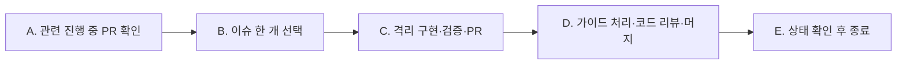

# Autonomous Issue Routine

이 문서는 Seorilabs repo의 **클라우드 autopilot 루틴**이 열린 GitHub 이슈를 자동으로 해결할 때 따르는 org 공통 절차다. 리뷰 판정은 `contracts/review-policy.yaml`, 필수 품질 진입점은 `contracts/test-policy.yaml`, 저장소별 실행 명령과 예외는 repo-local `AGENTS.md`를 따른다.

## 사용 방법

- 루틴 프롬프트는 짧게 유지한다. "repo-local 가이드와 이 문서를 읽고 그대로 따르라"만 지시한다.
- 각 repo는 repo-local 가이드(예: `docs/08-ops/autopilot.md`)에 이 문서가 다루지 않는 stack·repo별 실행 정보를 담는다. 조직 계약과 충돌하면 `contracts/`가 우선하며, repo-local 가이드는 조직 계약을 약화할 수 없다.
- 이 문서는 [agent-contribution-contract.md](./agent-contribution-contract.md)의 PR 계약과 [seorilabs-agent-contribution-system.md](./seorilabs-agent-contribution-system.md)의 역할 분리를 전제로 한다. 기계 판독 계약과 충돌하면 `contracts/`를 우선한다.

## 핵심 모델 — 한 실행 한 이슈

이 루틴은 한 실행에서 **정확히 한 개의 검증 가능한 이슈만** 선택한다. 같은 이슈를 닫는 열린 PR이 있으면 새 이슈를 고르지 않고 그 PR부터 종결한다. 하나의 PR이 머지·종료되면 이번 실행을 끝내고 다음 트리거가 백로그를 다시 평가한다.

### A. 관련 진행 중인 PR 먼저 처리

- 열린 PR과 `Closes #N` 연결을 확인한다. 같은 이슈를 닫는 열린 PR이 있으면 새 이슈를 고르지 않는다.
- 해당 PR을 아래 C·D 절차로 종결하고 이번 실행을 끝낸다.

### B. 새 이슈 선택 (열린 `issue/` PR이 없을 때)

- 원격 기본 브랜치를 fetch하고 최신 `origin/main`을 확인한다. 사용자의 dirty·untracked 변경을 보존하며 `reset`, `clean`, `stash`, `rebase`, `pull`, `checkout`으로 우회하지 않는다.
- `gh issue list --state open --search "-label:no-autopilot" --limit 100 --json number,title,labels`로 `no-autopilot` 라벨이 없는 모든 열린 이슈를 나열한다. `no-autopilot` 라벨(별도 트랙·보류)이 붙은 이슈는 제외하고 절대 건드리지 않는다.
- 우선순위: `P1` → `P2` → `P3` → `P4`. 같은 우선순위면 이슈 번호가 작은 것 우선. P 라벨이 없는 이슈는 P 라벨 이슈를 모두 처리한 뒤 번호순. 같은 우선순위대 안의 축 순서는 repo-local 가이드가 정한다.
- `blocked` 라벨 이슈, 이미 `Closes #N` 열린 PR이 달린 이슈는 SKIP. 선택 가능한 이슈가 없으면 종료(no-op). 최상위 1개만 고른다.

### C. 구현 · 검증 · PR

- 맥락을 먼저 읽는다: repo-local 가이드, `README.md`/`AGENTS.md`, 선택한 이슈 본문(인수조건). 구조·경계는 repo-local 가이드를 따른다.
- 최신 `origin/main`에서 격리 worktree와 `feature/issue-<번호>-<짧은-슬러그>` 브랜치를 만든다. 인수조건을 충족하는 **최소 변경만** 한다(범위 밖 리팩터링 금지). 주변 코드 스타일·타입 규칙을 준수한다. `.gitignore`를 존중해 빌드 산출물·비밀·임시 파일을 커밋하지 않는다.
- **테스트 동반 의무(범위에 포함)**: 각 인수조건마다 그 동작을 검증하는 테스트를 같은 PR에 추가/갱신한다. 버그 수정은 그 버그를 재현하는 회귀 테스트를 동반한다. 핵심 로직(상태·저장·데이터 처리·완료 판정·이벤트/계약) 변경에 대응 테스트가 없으면 서리봇이 test-gap으로 머지를 차단하므로, 테스트는 "최소 변경"의 예외가 아니라 필수 범위다. 단 순수 config/release/scaffolding/docs/포맷·rename 변경, 생성 파일, 헤드리스로 검증 불가한 GUI/렌더 동작은 테스트 면제(PR에 사유 명시).
- 검증: repo-local 가이드가 지정한 게이트를 실행하고 결과를 기록한다. 내 변경으로 게이트가 깨지면 PR 전에 고친다. 헤드리스로 실행 불가한 시각·실기기 검증은 "실행 불가(리뷰 위임)"로 명시한다.
- 한글 커밋·push 후 `gh pr create`로 **Ready**(draft 아님) PR을 base `main`으로 연다. 제목·본문은 **한글**(고유명사·명령어·코드·에러 메시지는 원문 유지). 본문은 아래 섹션을 **분리**해 작성한다 — 봇은 `검증` 섹션을 인수조건으로 해석하지 않으므로 인수조건과 검증을 절대 섞지 않는다:
  - **개요**: 변경 목적과 범위.
  - **인수조건**: 선택한 이슈 본문의 인수조건을 **그대로** 체크리스트(`- [ ]`)로 옮긴다. 임의로 줄이거나 새로 발명하지 않는다(heading은 `인수조건`/`요구사항`/`Definition of Done`/`동작`/`기대 동작` 중 적절히).
  - **검증**: 실행한 test/lint/typecheck/build와 결과, 실행하지 못한 검증과 그 이유(헤드리스 한계 등). 수동·시각·실기기 검증은 자동 test처럼 꾸미지 말고 `수동 검증`으로 표기한다.
  - 반드시 `Closes #<번호>`.
  - 변경 구조·흐름 이해에 도움되면 Mermaid를 포함하되, 단순 변경이면 생략한다.

상세 PR 계약은 [agent-contribution-contract.md](./agent-contribution-contract.md)를 따른다.

### D. 가이드 처리·코드 리뷰·머지

`contracts/review-policy.yaml`과 `seori-pr-workflow` 계약을 따른다. Seori는 PR 최초 턴의 acceptance guide이며 코드 승인자가 아니다.

- 각 미해결 Seori thread에 수정 결과 또는 현재 구현이 타당한 근거를 같은 thread에 한글로 답하고 Resolve한다.
- 새 push 뒤 Seori AI 재리뷰나 Seori approval을 기다리지 않는다. `neutral`은 미해결 thread와 다른 required gate를 직접 확인한 뒤 비차단으로 처리할 수 있다.
- 미해결 Seori thread가 0개이고 repo CI가 green인 최종 HEAD에서 Copilot review를 최초 한 번 요청한다.
- Copilot 지적은 수정·소명·후속 이슈 중 하나로 처리하고 모든 thread를 Resolve한다.
- Copilot이 `unable-to-review`를 남겼거나 1차 리뷰 반영이 새 함수·파일·분기를 만든 경우에만 최종 HEAD에서 한 번 더 요청한다. PR당 총 요청은 최대 2회이고 성공 리뷰는 1~2회다.
- required check가 통과하고 conflict가 없으면 `gh pr merge <N> --squash --delete-branch`로 병합한다.
- 최초 가이드가 10분 이상 전혀 없을 때만 복구 `/review`를 한 번 요청한다. Copilot 추가 요청은 위 조건에서만 허용한다.
- ruleset이나 권한이 병합을 막으면 우회하지 않고 GitHub가 반환한 정확한 blocker를 보고한다.

### E. 상태 확인 후 종료

- PR과 연결 이슈의 최종 상태, merge SHA, 기본 브랜치 반영을 확인한다.
- 이번 실행에서는 다음 이슈를 선택하지 않는다.
- 임시 worktree는 병합과 원격 반영이 확인된 뒤 별도의 안전한 정리 절차로 제거한다.

## 라벨 · 우선순위 규칙

| 라벨 | 의미 |
| --- | --- |
| `autopilot` | 이 루틴이 처리 대상으로 삼는 이슈(선택) |
| `P1`~`P4` | 우선순위. 없으면 P 라벨 이슈 뒤 번호순 |
| `no-autopilot` | **작업 금지**. 아트/SDK/번역/스토어 등 별도 트랙·보류 |
| `blocked` | 선행 조건 미충족 → SKIP |

## 승인 게이트

- 릴리스/프로덕션 submit, track promotion, public release는 **사람 승인 없이 하지 않는다**.
- 기획 승인 전 신규 app code/repo/store registration을 만들지 않는다.
- version impact가 `major`(저장 데이터·economy·core rule·release process 변경)면 사람 승인 전 머지/릴리스를 막는다.

## 안전 규칙

- 모든 PR·커밋·코멘트는 한글로 작성한다(고유명사·명령어·코드·에러 메시지는 원문 유지).
- AI 도구가 생성했다는 서명이나 홍보 문구("Generated with Claude" 류)를 커밋·PR·문서에 넣지 않는다.
- 같은 자동화가 소유한 열린 이슈 PR은 최대 1개이고, 한 실행에서 새로 선택하는 이슈도 최대 1개다.
- `no-autopilot` 라벨 이슈는 작업 금지. `main` force-push 금지. 다른 열린 PR 수정 금지.
- 머지는 squash + 브랜치 삭제. 미해결 review thread가 없고 required check와 CI가 통과한 current HEAD만 병합한다.
- 기본 checkout의 dirty 변경을 건드리지 않고 최신 `origin/main` 기반 격리 worktree를 사용한다.
- 토큰·키·service account를 client/repo에 추가하거나 로그에 노출하지 않는다.

## repo-local 가이드가 제공해야 하는 것

이 문서는 stack-agnostic하다. 각 repo의 가이드는 다음을 채운다:

- **스택/구조 맵**: 엔진/프레임워크, 핵심 디렉터리, core/adapters 경계.
- **게이트·검증 명령**: lint/typecheck/test/build의 실제 명령과, 변경 종류별 필수 게이트.
- **엔진/툴 바이너리 확보법**: 클라우드 샌드박스에서 Godot/Node/pnpm 등을 확보하는 방법.
- **우선순위 축**: 같은 P 라벨대 안에서의 정렬 기준(예: 잔존율 > 수익화 > 기능).
- **i18n 규칙**: 지원 로케일, 문자열 추가 시 함께 갱신할 파일.
- **IA/화면 밀도 제약**: 신규 UI를 상시 HUD에 쌓지 말고 뎁스로 분리하는 규칙 등.
- **source-of-truth 경로**: 스펙·작업 로그·릴리스 상태를 남길 위치.
