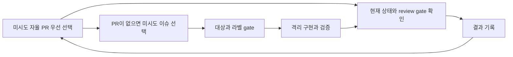

# Autonomous Issue Routine

이 문서는 Seorilabs 자율 이슈를 한 번에 한 항목씩 직렬로 구현·검증하면서, 한 실행 안에서 적격 큐를 계속 처리하는 조직 공통 계약이다. 로컬 스킬이 없는 클라우드 환경도 [`autonomous-issue-policy.yaml`](../../contracts/autonomous-issue-policy.yaml), 이 문서와 대상 저장소 문서만으로 `autopilot:cloud` 이슈를 처리할 수 있어야 한다.

## 읽기 순서와 실행 환경

1. `contracts/autonomous-issue-policy.yaml`
2. 이 문서
3. `contracts/review-policy.yaml`, `contracts/test-policy.yaml`, `contracts/release-policy.yaml`
4. 대상 저장소의 `AGENTS.md`, `.seorilabs/app.yaml`, README와 repo-local 실행 문서
5. 선택한 이슈 본문과 연결된 PR·review thread
6. 로컬 환경에 관련 스킬이 있으면 구현·검증 어댑터로 사용

기계 판독 계약과 문서가 충돌하면 계약이 우선한다. repo-local 문서는 stack·명령·제품 고유 제약만 보강하며 조직 계약을 약화할 수 없다.

- 로컬 예약 작업은 `autopilot:local`과 `autopilot:cloud`을 모두 처리할 수 있다.
- 클라우드 실행은 `autopilot:cloud`만 처리한다. `autopilot:local`을 클라우드 도구로 추측하거나 우회하지 않는다.
- `processing=EXCLUDED`는 가장 앞선 차단 gate다. 해당 저장소를 clone하거나 이슈·PR을 변경하지 않는다.
- `processing=DISABLED` 또는 정책에 없는 저장소도 건드리지 않는다.

## 핵심 모델 — 실행당 직렬 큐 소진

실행당 처리 건수 상한은 두지 않는다. 다만 한 시점에는 처리 항목 하나만 다루고, 같은 실행에서 같은 PR 또는 이슈를 두 번 시도하지 않는다. 열린 자율 PR을 먼저 종결한 뒤 새 이슈를 선택하며, 항목 하나가 머지·종료·차단 상태에 도달하면 실행 예산이 허용하는 동안 다음 미시도 항목으로 넘어간다.

실행은 다음 중 하나일 때 끝낸다.

- 미시도 적격 PR과 이슈가 없음
- 다음 항목을 안전하게 시작할 실행 예산이 없음
- 중앙 계약·GitHub 접근·격리 실행 자체를 막는 전역 안전 차단이 있음

개별 PR이나 이슈의 사람 승인, 외부 상태, repo-local 실패는 해당 항목의 blocker로 기록하고 같은 실행의 미시도 집합에서 제외한다. 다른 적격 항목까지 막지 않는다.

## 진행 중인 PR 우선

- ENABLED 저장소의 열린 PR과 `closingIssuesReferences`를 확인한다.
- `autopilot` 이슈를 닫는 PR이 있으면 그 PR의 현재 HEAD, CI, Seori·Copilot thread와 mergeability를 먼저 확인한다.
- 현재 처리 항목을 다루는 동안 다른 PR이나 이슈를 병렬로 수정하지 않는다.
- PR이 사람 승인, 외부 상태 또는 repo-local 실패로 막히면 정확한 blocker를 기록하고 이번 실행의 미시도 집합에서 제외한 뒤 다른 열린 자율 PR을 확인한다.
- 중앙 계약을 읽을 수 없거나 GitHub 인증이 끊기는 등 모든 항목에 영향을 주는 전역 차단이면 실행을 끝낸다.

## 새 이슈 선택

후보는 다음 조건을 모두 만족해야 한다.

- 저장소의 `processing=ENABLED`
- 이슈가 `OPEN`
- `autopilot` 포함
- `autopilot:local` 또는 `autopilot:cloud` 중 정확히 하나
- `P1`~`P4` 중 정확히 하나
- `no-autopilot`, `blocked`, `approval:*` 없음
- 같은 이슈를 닫는 열린 PR 없음
- 현재 실행 환경이 실행 라벨을 지원

라벨이 누락되거나 상충하면 자동으로 추측해 고치지 않고 부적격 사유를 보고한다. 제목의 레거시 말머리나 `U숫자`·`N숫자`를 선택 순서로 사용하지 않는다.

후보는 P1→P2→P3→P4 순으로 정렬하고, 같은 우선순위에서는 `createdAt`, 이슈 번호 오름차순으로 고른다. 매 반복에서 아직 시도하지 않은 최상위 한 개를 선택한다. 후보가 없으면 열린 자율 PR의 미시도 항목을 다시 확인하고, 둘 다 없으면 종료한다.

## 구현 전 재검증

1. 원격 기본 브랜치와 exact HEAD를 fetch한다.
2. 이슈의 고객 가치, 문제·근거, 범위, 인수조건, 검증 방법, 실행 환경 절을 읽는다.
3. 현재 코드와 이미 반영된 PR을 대조해 이슈가 여전히 유효한지 확인한다.
4. `autopilot:local`이면 본문에 적힌 로컬 스킬·데이터·기기·콘솔을 실제로 사용할 수 있는지 확인한다. 없으면 구현하지 않고 blocker를 보고한다.
5. 범위가 기획 결정, 신규 콘텐츠, 일반 밸런스·경제 확장, 배포·심사·공개 출시로 바뀌었으면 자동 구현하지 않는다.

이미 해결됐거나 중복이면 현재 근거를 이슈에 남기고 안전하게 종결한다. 인수조건이 모호하거나 제품 결정을 요구하면 임의 구현 대신 `blocked` 또는 적절한 `approval:*` gate로 전환하고 종료한다.

## 격리 구현과 검증

- 기본 checkout의 dirty·untracked 변경을 보존한다. `reset`, `clean`, `stash`, `rebase`, `checkout`으로 사용자 상태를 바꾸지 않는다.
- 최신 원격 기본 브랜치에서 이슈 전용 격리 worktree와 브랜치를 만든다.
- 인수조건을 충족하는 최소 변경만 하고 관련 없는 리팩터링·기능 확장을 하지 않는다.
- 각 인수조건을 검증하는 테스트를 추가하거나 갱신한다. 버그 수정에는 회귀 테스트를 동반한다.
- 순수 문서·설정·생성 파일·헤드리스로 검증할 수 없는 시각·실기기 동작은 테스트 면제 사유와 미검증 범위를 PR에 적는다.
- repo-local 명령과 `contracts/test-policy.yaml`의 필수 진입점을 실행한다. 실행하지 못한 검증은 성공으로 표현하지 않는다.
- 비밀값, 빌드 산출물과 임시 파일을 커밋하지 않는다.

## Ready PR

커밋과 PR 제목·본문은 한국어로 작성하고 AI 생성 서명을 넣지 않는다. PR은 Draft가 아닌 Ready로 만든다.

PR 본문에는 다음을 분리해 기록한다.

- `개요`: 고객 문제와 변경 범위
- `인수조건`: 이슈 체크리스트를 축소하지 않고 그대로 옮김
- `검증`: 실행한 명령과 결과, 실행하지 못한 검증과 이유
- `Closes #<번호>`

단순 변경에는 Mermaid를 넣지 않는다. PR 생성 뒤 current HEAD와 check를 readback한다.

## Seori·Copilot·머지 gate

`contracts/review-policy.yaml`을 그대로 따른다.

1. Seori는 최초 인수조건 가이드이며 코드 승인자가 아니다. PR 직후 중복 `/review`를 보내지 않는다.
2. `Seori Review=action_required`이면 각 미해결 Seori thread에 수정 결과 또는 현재 구현이 타당한 근거를 같은 thread에 한국어로 답하고 Resolve한다.
3. 새 push 뒤 Seori AI 재리뷰나 Seori approval을 기다리지 않는다. 최초 가이드가 10분 넘게 전혀 없을 때만 복구 `/review`를 한 번 요청한다.
4. 미해결 Seori thread가 없고 repo CI가 green인 최종 HEAD에서 `gh pr edit <PR> --add-reviewer "@copilot"`으로 Copilot review를 한 번 요청한다.
5. Copilot 지적마다 수정·소명·후속 이슈 중 하나로 답하고 thread를 Resolve한다. `unable to review` 또는 수정이 새 함수·파일·분기를 만든 경우에만 한 번 더 요청한다. 총 요청은 두 번을 넘지 않는다.
6. Ready, current HEAD, required check·CI green, conflict 없음, 미해결 thread 0개를 직접 확인한다.
7. 모든 gate가 통과하면 `gh pr merge <PR> --squash --delete-branch`로 병합한다. ruleset이나 권한이 막으면 우회하지 않는다.

## 항목 종결과 실행 종료

- PR 상태, merge SHA, 연결 이슈 close, 원격 기본 브랜치 반영을 확인한다.
- 병합과 원격 반영 뒤에만 격리 worktree를 안전하게 정리한다.
- 처리 결과를 이번 실행의 시도 집합에 기록하고, 실행 종료 조건에 해당하지 않으면 다음 미시도 항목을 고른다.
- 릴리스 생성, artifact upload, 실기기 QA, 마켓 심사, 승인, 배포와 공개 상태는 별도 단계다. 이 루틴은 사람 승인 없이 이를 수행하거나 완료로 표현하지 않는다.

실행 보고에는 항목별 저장소·이슈·실행 라벨, 구현·검증·PR·review·merge 상태, 다음으로 넘긴 blocker와 실행 종료 사유를 한국어로 구분해 남긴다.
