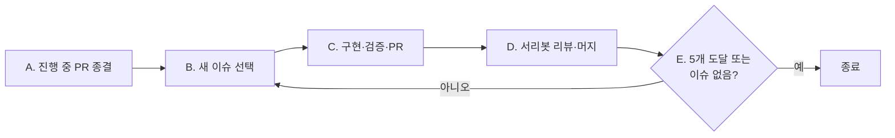

# Autonomous Issue Routine

이 문서는 Seorilabs repo의 **클라우드 autopilot 루틴**(claude.ai routine 등 무인 세션)이 열린 GitHub 이슈를 자동으로 해결할 때 따르는 org 공통 계약이다. 목적은 각 루틴 프롬프트에 같은 절차를 복붙하지 않고, 이 문서 한 곳에서 순차 드레인 루프와 서리봇 리뷰 계약을 관리하는 것이다.

## 사용 방법

- 루틴 프롬프트는 짧게 유지한다. "repo-local 가이드와 이 문서를 읽고 그대로 따르라"만 지시한다.
- 각 repo는 repo-local 가이드(예: `docs/08-ops/autopilot.md`)에 이 문서가 다루지 않는 repo별 실행 정보를 담는다. 충돌 시 **repo-local 가이드가 우선**한다.
- 이 문서는 [agent-contribution-contract.md](./agent-contribution-contract.md)의 PR 계약과 [seorilabs-agent-contribution-system.md](./seorilabs-agent-contribution-system.md)의 역할 분리를 전제로 한다.

## 핵심 모델 — 순차 드레인 루프

이 루틴은 **열린 이슈 백로그를 순차적으로 비운다**. 이슈 1개를 골라 PR → 서리봇 리뷰 → 머지까지 끝낸 뒤 다음 이슈로 넘어가 반복한다. **동시에 열린 `issue/` PR은 항상 최대 1개**(같은 파일을 건드리는 이슈끼리의 머지 충돌 방지). 한 실행에서 **최대 5개 이슈**까지만 처리하고, 더 있으면 다음 트리거 실행이 이어받는다.

### A. 진행 중인 PR 먼저 처리 (매 실행 시작 시)

- `gh pr list --state open --json number,headRefName,title,url,reviewDecision`에서 브랜치명이 `issue/`로 시작하는 열린 PR을 확인한다(그 외 브랜치 PR은 무시).
- 그런 PR이 있으면 새 이슈를 고르기 전에 그 PR을 먼저 종결시킨다(아래 C·D 절차로 머지까지). 이 PR이 머지/종료되기 전에는 새 이슈를 고르지 않는다.

### B. 새 이슈 선택 (열린 `issue/` PR이 없을 때)

- 먼저 main을 최신화한다: `git checkout main && git pull --ff-only`.
- `gh issue list --state open --search "-label:no-autopilot" --limit 100 --json number,title,labels`로 `no-autopilot` 라벨이 없는 모든 열린 이슈를 나열한다. `no-autopilot` 라벨(별도 트랙·보류)이 붙은 이슈는 제외하고 절대 건드리지 않는다.
- 우선순위: `P1` → `P2` → `P3` → `P4`. 같은 우선순위면 이슈 번호가 작은 것 우선. P 라벨이 없는 이슈는 P 라벨 이슈를 모두 처리한 뒤 번호순. 같은 우선순위대 안의 축 순서는 repo-local 가이드가 정한다.
- `blocked` 라벨 이슈, 이미 `Closes #N` 열린 PR이 달린 이슈는 SKIP. 선택 가능한 이슈가 없으면 종료(no-op). 최상위 1개만 고른다.

### C. 구현 · 검증 · PR

- 맥락을 먼저 읽는다: repo-local 가이드, `README.md`/`AGENTS.md`, 선택한 이슈 본문(인수조건). 구조·경계는 repo-local 가이드를 따른다.
- 브랜치 `issue/<번호>-<짧은-슬러그>`를 만든다. 인수조건을 충족하는 **최소 변경만** 한다(범위 밖 리팩터링 금지). 주변 코드 스타일·타입 규칙을 준수한다. `.gitignore`를 존중해 빌드 산출물·비밀·임시 파일을 커밋하지 않는다.
- **테스트 동반 의무(범위에 포함)**: 각 인수조건마다 그 동작을 검증하는 테스트를 같은 PR에 추가/갱신한다. 버그 수정은 그 버그를 재현하는 회귀 테스트를 동반한다. 핵심 로직(상태·저장·데이터 처리·완료 판정·이벤트/계약) 변경에 대응 테스트가 없으면 서리봇이 test-gap으로 머지를 차단하므로, 테스트는 "최소 변경"의 예외가 아니라 필수 범위다. 단 순수 config/release/scaffolding/docs/포맷·rename 변경, 생성 파일, 헤드리스로 검증 불가한 GUI/렌더 동작은 테스트 면제(PR에 사유 명시).
- 검증: repo-local 가이드가 지정한 게이트를 실행하고 결과를 기록한다. 내 변경으로 게이트가 깨지면 PR 전에 고친다. 헤드리스로 실행 불가한 시각·실기기 검증은 "실행 불가(리뷰 위임)"로 명시한다.
- 한글 커밋·push 후 `gh pr create`로 **Ready**(draft 아님) PR을 base `main`으로 연다. 제목·본문은 **한글**(고유명사·명령어·코드·에러 메시지는 원문 유지). 본문은 아래 섹션을 **분리**해 작성한다 — 봇은 `검증` 섹션을 인수조건으로 해석하지 않으므로 인수조건과 검증을 절대 섞지 않는다:
  - **개요**: 변경 목적과 범위.
  - **인수조건**: 선택한 이슈 본문의 인수조건을 **그대로** 체크리스트(`- [ ]`)로 옮긴다. 임의로 줄이거나 새로 발명하지 않는다(heading은 `인수조건`/`요구사항`/`Definition of Done`/`동작`/`기대 동작` 중 적절히).
  - **검증**: 실행한 test/lint/typecheck/build와 결과, 실행하지 못한 검증과 그 이유(헤드리스 한계 등). 수동·시각·실기기 검증은 자동 test처럼 꾸미지 말고 `수동 검증`으로 표기한다.
  - 반드시 `Closes #<번호>`.
  - 변경 구조·흐름 이해에 도움되면 Mermaid를 포함하되, 단순 변경이면 생략한다.

상세 PR 계약은 [agent-contribution-contract.md](./agent-contribution-contract.md)를 따른다.

### D. 서리봇 리뷰 받고 머지 (루프의 핵심)

`seori-pr-workflow` 계약을 따른다. Seori PR Bot은 PR open과 새 push를 자동 review하므로, PR 직후 `@seori /review`를 중복 호출하지 않는다.

- current HEAD를 기록하고 약 10분 간격으로 `gh pr view <N> --json headRefOid,reviews,reviewDecision,comments,statusCheckRollup,mergeStateStatus`를 폴링한다.
- current-HEAD `Seori Review`가 `queued`/`in-progress`이면 기다린다. pending CI 때문에 approval을 보류하는 동안에도 재요청하지 않는다.
- `action_required`/`CHANGES_REQUESTED` → current-HEAD check·comment·unresolved thread의 근거를 읽고 최소 수정·검증·한글 답글 후 push한다. synchronize가 자동 재리뷰하므로 push 직후 별도 `/review`를 보내지 않는다.
- `neutral` → check 자체는 non-failing이지만 **approval이 아니다**. 같은 HEAD에서 PASS를 얻으려고 재요청하지 말고, current-HEAD approval이 없으므로 **절대 머지하지 않은 채** unresolved scope를 사람에게 handoff하고 이번 실행을 종료한다.
- current HEAD의 `reviewDecision`이 **APPROVED**이고 current-HEAD `statusCheckRollup`이 통과면: `@seori`가 이미 머지했으면 그대로 두고, 아직 열려 있으면 세션이 직접 머지한다: `gh pr merge <N> --squash --delete-branch`. 새 push 이전 approval은 stale이며, CI가 실패 상태면 머지하지 말고 먼저 고친다.
- PR open 또는 마지막 push 후 10분이 지나도 current-HEAD `Seori Review` check가 **전혀 없을 때만** `gh pr comment <N> --body "@seori /review"`를 복구 요청으로 **1회** 보낸다. 그 뒤에도 없으면 반복하지 않고 PR을 열린 채 이번 실행을 종료해 다음 트리거/운영자에게 handoff한다.

### E. 다음 이슈로 루프

- PR이 머지되면 멈추지 말고 **B단계로 돌아가** 다음 이슈를 이어서 처리한다(main 최신화 포함). 처리한 이슈 수가 5개에 도달하거나, 선택 가능한 이슈가 없거나, 남은 작업 예산이 부족하면 종료한다.

## 라벨 · 우선순위 규칙

| 라벨 | 의미 |
| --- | --- |
| `autopilot` | 이 루틴이 처리 대상으로 삼는 이슈(선택) |
| `P1`~`P4` | 우선순위. 없으면 P 라벨 이슈 뒤 번호순 |
| `no-autopilot` | **작업 금지**. 아트/SDK/번역/스토어 등 별도 트랙·보류 |
| `blocked` | 선행 조건 미충족 → SKIP |

## 승인 게이트

- 릴리스/프로덕션 submit, track promotion, public release는 **사람 승인 없이 하지 않는다**.
- 기획 승인 전 신규 app code/repo/store registration을 만들지 않는다.
- version impact가 `major`(저장 데이터·economy·core rule·release process 변경)면 사람 승인 전 머지/릴리스를 막는다.

## 안전 규칙

- 모든 PR·커밋·코멘트는 한글로 작성한다(고유명사·명령어·코드·에러 메시지는 원문 유지).
- AI 도구가 생성했다는 서명이나 홍보 문구("Generated with Claude" 류)를 커밋·PR·문서에 넣지 않는다.
- 동시에 열린 `issue/` PR은 최대 1개. 한 실행 최대 5이슈.
- `no-autopilot` 라벨 이슈는 작업 금지. `main` force-push 금지. 다른 열린 PR 수정 금지.
- 머지는 squash + 브랜치 삭제. current-HEAD `APPROVED` + CI green일 때만 머지하고 `neutral`은 절대 머지하지 않는다.
- 머지 전 항상 `git checkout main && git pull --ff-only`로 직전 변경을 반영해 충돌을 피한다.
- 토큰·키·service account를 client/repo에 추가하거나 로그에 노출하지 않는다.

## repo-local 가이드가 제공해야 하는 것

이 문서는 stack-agnostic하다. 각 repo의 가이드는 다음을 채운다:

- **스택/구조 맵**: 엔진/프레임워크, 핵심 디렉터리, core/adapters 경계.
- **게이트·검증 명령**: lint/typecheck/test/build의 실제 명령과, 변경 종류별 필수 게이트.
- **엔진/툴 바이너리 확보법**: 클라우드 샌드박스에서 Godot/Node/pnpm 등을 확보하는 방법.
- **우선순위 축**: 같은 P 라벨대 안에서의 정렬 기준(예: 잔존율 > 수익화 > 기능).
- **i18n 규칙**: 지원 로케일, 문자열 추가 시 함께 갱신할 파일.
- **IA/화면 밀도 제약**: 신규 UI를 상시 HUD에 쌓지 말고 뎁스로 분리하는 규칙 등.
- **source-of-truth 경로**: 스펙·작업 로그·릴리스 상태를 남길 위치.
