# Seorilabs Agent Contribution System

## 목적

Seorilabs org 아래 여러 repo에 원격 Claude, Codex, Gemini Bot 등 에이전트가 계속 PR을 만들 수 있다. 이를 막는 것이 목표가 아니라, 모든 agent contribution이 같은 계약을 따르게 만들어 무작위 PR을 통제 가능한 실행 흐름으로 바꾸는 것이 목표다.

핵심 원칙:

- 장기 작업은 티켓 없이 시작하지 않는다.
- PR은 실행 티켓, 스펙, 검증 증거를 가진다.
- 에이전트는 스스로 product planning approval 또는 release approval을 통과시킬 수 없다.
- 생성하는 스킬과 반영하는 스킬을 분리한다.
- `Done`은 merge가 아니라 검증, 배포, live 확인, source-of-truth 갱신까지 끝난 상태다.

```mermaid
flowchart LR
  Idea["Issue / Project Ticket"] --> Spec["Spec Contract\nscope, version impact, acceptance"]
  Spec --> Contributor["Contributor Skill\nClaude / Codex 작업 생성"]
  Contributor --> PR["Pull Request\ncontract + evidence"]
  PR --> Intake["Intake / Triage"]
  Intake --> Reviewer["Review Bot / CI / Human Review"]
  Reviewer --> Integrator["Integrator Skill\nmerge readiness, versioning, docs"]
  Integrator --> Release["QA / Release Gate"]
  Release --> Done["Done\nverified + documented"]
  Done --> Vault["Obsidian/Vault\n결정과 승인 기록"]
```



## 구성 요소

| 영역 | 역할 | 위치 |
| --- | --- | --- |
| 운영 계약 | agent가 따라야 하는 조직 공통 규칙 | `.github/docs/agent-governance/` |
| 자율 이슈 정책 | 대상 저장소·라벨·제목·실행 환경·등록 상한·처리 모드 | `.github/contracts/autonomous-issue-policy.yaml` |
| 자율 이슈 등록 계약 | 근거 gate와 실행 환경 분류를 거쳐 한 회차 한 이슈 등록 | `.github/docs/agent-governance/autonomous-issue-registration.md` |
| 자율 이슈 처리 계약 | 한 시점 한 이슈를 지키는 실행당 직렬 drain 절차 | `.github/docs/agent-governance/autonomous-issue-routine.md` |
| 실행 대시보드 | issue/PR/draft item의 상태와 우선순위 | GitHub Organization Project |
| Source of truth | 기획, 의사결정, 승인 기록 | Obsidian/Vault |
| Repo-local spec | 코드와 같이 versioned 되는 실행 스펙 | 각 repo의 `docs/`, `specs/`, release metadata |
| Contributor skill | 작업 생성 agent가 읽고 따라야 하는 루틴 | Codex skill 또는 Claude instruction |
| Integrator skill | 들어온 PR을 triage, review, merge 준비하는 루틴 | Codex skill |
| Review bot | PR comment, CI, policy feedback 자동화 | `gemini-pr-bot` 및 GitHub Actions |

## Agent 역할 분리

| 역할 | 할 수 있는 일 | 하지 말아야 할 일 |
| --- | --- | --- |
| Contributor | 티켓 선택, repo 동기화, 작은 변경, 테스트, PR 작성 | 승인 없는 scope 확대, release 제출, 임의 버전 bump |
| Reviewer | diff 검토, CI/테스트/정책 위반 지적 | product/release 승인 대체 |
| Integrator | PR intake, spec/version impact 확인, merge readiness 정리 | 근거 없는 merge, source-of-truth 미갱신 상태로 Done 이동 |
| Human | 기획 승인, 배포 승인, 우선순위 결정 | 반복 검증/정리 수작업 |

## Contribution 수용 계약

모든 agent PR은 다음 계약을 만족해야 한다.

- 연결된 GitHub Issue 또는 Project item이 있다.
- PR description에 `Refs #...` 또는 `Closes #...`가 있다.
- 변경 범위가 티켓의 scope와 맞다.
- version impact가 명시되어 있다.
- 검증 명령과 결과가 적혀 있다.
- source-of-truth 문서 갱신 여부가 적혀 있다.
- release 또는 production 영향이 있으면 `Release approval` 전에는 배포하지 않는다.

상세 템플릿은 [agent-contribution-contract.md](./agent-contribution-contract.md)를 기준으로 한다.

## 스펙과 버전 관리

각 repo는 변경 성격에 따라 다음 중 하나 이상의 versioned source를 가진다.

| 대상 | 권장 위치 | 예 |
| --- | --- | --- |
| 제품 스펙 | `docs/product-spec.md` 또는 `specs/*.md` | core gameplay, user flow, data model |
| 릴리즈 체크 | `docs/release-readiness.md` | market별 blocker, QA 상태 |
| Store metadata | `play-store/`, `app-store/`, `apps-in-toss/` | listing, screenshots, review notes |
| Remote Config | `firebase/remoteconfig.template.json` | feature flags, monetization flags |
| Architecture contract | `docs/architecture.md` | core/adapters boundary |

버전 영향 분류:

| Version impact | 의미 |
| --- | --- |
| `none` | docs, tests, CI, tooling 등 product behavior 변화 없음 |
| `patch` | 버그 수정, 안전한 UI 수정, policy/readiness fix |
| `minor` | 신규 기능, 새 market target, user-visible behavior 추가 |
| `major` | 저장 데이터, economy, core rule, public contract, release process의 큰 변경 |

에이전트는 `version impact`를 제안할 수 있지만, exact source commit의 release tag 생성과 배포 승인은 사람이 확정한다. 실제 store/build version은 그 GitHub tag에서만 파생한다.

세부 기준은 [spec-versioning-policy.md](./spec-versioning-policy.md)를 따른다.

## Project 필드 확장

[seorilabs-github-project-schema.yml](../project-management/seorilabs-github-project-schema.yml)에 다음 필드를 추가해 agent contribution을 추적한다.

| Field | Type | 용도 |
| --- | --- | --- |
| `Agent` | Single select | PR 또는 티켓을 주도한 agent |
| `Contribution Type` | Single select | bugfix, feature, QA, release-prep, docs, ops 등 |
| `Spec Version` | Text | 변경이 기준으로 삼은 spec/release 문서 버전 또는 path |
| `Version Impact` | Single select | none, patch, minor, major |
| `Intake State` | Single select | Needs ticket, Needs spec, Needs tests, Ready for review, Accepted, Rejected |

## Branch와 PR 규칙

권장 branch prefix:

- `agent/<tool>/<ticket>-<short-slug>`
- `codex/<ticket>-<short-slug>`
- `claude/<ticket>-<short-slug>`
- `bot/<purpose>`

PR 제목:

```text
[repo] 티켓 범위 요약
```

PR description 필수 섹션:

- 티켓
- 범위
- 스펙 / 버전 영향
- 검증
- 리스크
- 롤백
- source-of-truth 갱신 여부

## 무작위 PR 통제 방식

무작위 PR을 완전히 막기보다, 수용 기준을 좁힌다.

1. 티켓 없는 PR은 `Needs ticket`으로 돌리고 merge하지 않는다.
2. 스펙 영향이 있는데 spec/doc update가 없으면 `Needs spec`으로 돌린다.
3. 테스트/검증 증거가 없으면 `Needs tests`로 돌린다.
4. scope가 너무 넓으면 작은 티켓/PR로 쪼개도록 요청한다.
5. release 영향이 있으면 `Release approval` 상태로 묶고 배포하지 않는다.
6. 유효하지 않은 PR은 닫되, 재사용 가능한 발견은 티켓이나 Vault에 남긴다.

## 단계별 도입

별도 종료 지점 없이 실제 작업부터 적용한다.

1. `.github` repo에 agent governance 문서를 둔다.
2. Project field와 티켓 템플릿에 agent/spec/version 정보를 추가한다.
3. PR template과 contribution guideline을 조직 공통으로 추가한다.
4. Contributor skill 초안을 만든다.
5. Integrator skill 초안을 만든다.
6. 원격 Claude/Codex 루틴이 이 문서를 읽도록 각 실행 환경의 system/project instruction에 연결한다.
7. 들어오는 PR부터 intake 기준을 적용한다.
8. 반복되는 예외를 문서와 스킬에 반영한다.

## 보류 결정

- 실제 Codex skill 생성 위치: `$CODEX_HOME/skills` 또는 별도 repo mirror
- ~~Claude instruction 배포 방식~~ → **확정(중앙 계약 구조)**: 간결한 루틴 프롬프트 → org 기계 계약([autonomous-issue-policy.yaml](../../contracts/autonomous-issue-policy.yaml)) → 등록 또는 처리 지침 → repo-local 가이드. 클라우드 autopilot은 대상 repo와 `.github`를 함께 체크아웃하고, 로컬 스킬 없이도 중앙 지침만으로 `autopilot:cloud` 이슈를 처리한다.
- PR template을 바로 조직 공통으로 활성화할지 여부
- Project 생성 후 기본 `Status` 재사용 또는 `Stage` custom field 사용 여부
