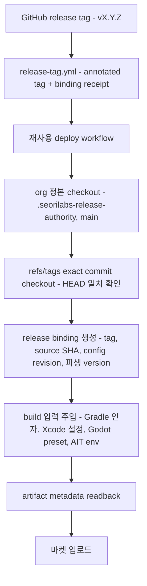

# 릴리즈 버전 authority

GitHub 릴리즈 태그 `vMAJOR.MINOR.PATCH`가 Google Play, Apple App Store, AppsInToss artifact의
**표시 버전 정본**이다. 플랫폼 릴리스 번호는 태그에서 파생하지 않는다. Android `versionCode`는 각 앱
저장소의 [릴리스 번호 원장](release-version-ledger.md)이 순차 할당하고, iOS `CFBundleVersion`은
Xcode Cloud의 `CI_BUILD_NUMBER`가 정본이다.

기계 판독 정본은
[`contracts/release-version-authority.yaml`](../../contracts/release-version-authority.yaml)이고,
구현은 [`scripts/release/`](../../scripts/release/)에만 둔다. 문서와 계약이 다르면 계약이 우선한다.

## 값의 정본

| 값 | 정본 | `v1.2.3` |
|---|---|---|
| display / marketing version | 태그에서 `v` 제거 | `1.2.3` |
| Android `versionName` | display version | `1.2.3` |
| Android `versionCode` | 저장소 원장이 `lastVersionCode + 1`로 할당 | 저장소마다 다르다 |
| Apple `CFBundleShortVersionString` | display version | `1.2.3` |
| Apple `CFBundleVersion` | Xcode Cloud `CI_BUILD_NUMBER` (그 밖의 Apple 경로는 encodedVersion) | `1002003` |
| Play release name | display version | `1.2.3` |

`encodedVersion`(`major * 1,000,000 + minor * 1,000 + patch`)은 여전히 태그가 정한다. 비 Xcode Cloud
Apple build number의 정본이고, Android와 iOS 런타임이 공유하는 최소지원버전 비교값
(`runtimeVersionCode = 1,000,000,000 + encodedVersion`)의 근거다. **마켓 Android versionCode는 아니다.**

`major`는 1099 이하, `minor`와 `patch`는 각각 1000 미만이어야 한다. `v0.0.0`은 encodedVersion이 `0`이라
Apple build number를 만들 수 없으므로 태그 생성과 배포 양쪽에서 `derived-version-code-out-of-range`로
막는다. 최소 사용 가능한 태그는 `v0.0.1`이다.

### Android versionCode를 태그에서 떼어낸 이유

태그 파생 공식은 앱이 실제로 몇 번 올렸는지와 무관하게 큰 수를 만든다. 첫 릴리스 `v1.0.1`이
`1001000001`이 되어 Google Play가 "최초 versionCode가 과도하게 높다"고 경고했다. 원장 할당에서는
신규 앱이 `1`부터 시작하고, 기존 앱은 검증된 마지막 번호에서 이어간다. 태그 번호와 릴리스 번호가
분리되므로 `v2.0.0`을 찍어도 versionCode는 직전 값 + 1이다.

할당 규칙, 원장 형식, 동시성과 원자성은 [릴리스 번호 원장](release-version-ledger.md)에 있다.

## Apple build number 예외: Xcode Cloud

계약 `schemaVersion 2`는 Apple build number의 정본을 실행 환경별로 나눈다. 기본값은 위 표의
`encoded-version`이고, **Xcode Cloud 경로만** `appleBuildNumberExceptions`로 분리한다.

| 값 | Xcode Cloud 정본 | `v0.1.9` + `CI_BUILD_NUMBER=6` |
|---|---|---|
| `CFBundleShortVersionString` | 태그에서 `v` 제거 | `0.1.9` |
| `CFBundleVersion` | Xcode Cloud가 발급한 `CI_BUILD_NUMBER` | `6` |

Xcode Cloud는 build마다 자기 카운터를 발급하고 App Store Connect는 그 번호로 build를 식별한다.
태그 파생 `encodedVersion`을 `CFBundleVersion`에 쓰면 `v0.1.9`가 `1009`, `v0.2.0`이 `2000`처럼
태그마다 값이 튀고, 같은 marketing version을 다시 올릴 때 번호가 되돌아가 업로드가 거부된다.

- `CI_BUILD_NUMBER`는 **필수**다. 값이 없거나 `0`이거나 정수가 아니면
  `xcode-cloud-build-number-invalid`로 build 전에 fail-closed한다.
- 태그 파생 `encodedVersion`은 이 경로에서 Apple build number가 아니라 런타임 최소지원버전
  비교값(`runtimeVersionCode`)으로만 남는다.
- marketing version은 여전히 태그 하나가 정본이다. 예외는 build number에만 적용된다.
- 나머지 Apple 경로(GitHub Actions `xcodebuild` archive, Godot iOS export preset)는
  `schemaVersion 1`과 같은 `encoded-version`을 그대로 쓴다.

## authority가 아닌 값

아래는 읽어서 버전을 정하지 않는다. 값이 필요하면 태그 파생값을 **주입**하고, build 후 artifact에서
다시 읽어 대조한다.

- `package.json`의 `version`
- Gradle `versionName` / `versionCode`
- Xcode `MARKETING_VERSION` / `CURRENT_PROJECT_VERSION`
- Godot `project.godot`, `export_presets.cfg`
- Granite / AppsInToss 설정
- `play-store/google-play.config.json`, `app-store/app-store.config.json`
- 저장소 로컬 `scripts/resolve-release-version.mjs`
- caller가 넘기던 `version_name`, `version_code`, `version_script` 입력
- `github.run_number` 같은 비결정 카운터 (Xcode Cloud `CI_BUILD_NUMBER`는 예외 계약이다)

## 실행 경로



1. **org 정본 checkout**: `seorilabs/.github`의 `main`을 `.seorilabs-release-authority`에 받는다.
   caller 저장소의 스크립트는 버전 결정에 쓰지 않는다. 실제 실행된 중앙 커밋은
   `job.workflow_sha`로 release binding에 기록된다.
2. **exact tag commit**: `refs/tags/<tag>`로만 checkout한다. 동명 branch를 잡지 않고, checkout HEAD가
   태그 commit과 다르면 실패한다.
3. **release binding**: `tag`, `sourceSha`, `configRevision`, 파생 version을 하나의 JSON으로 고정한다.
   `authorityRevision`은 이 계약 본문의 sha256이고, `configRevision`은 여기에 called workflow
   repository/ref/SHA를 더한 값이다. 전자는 tag receipt로 대조하고 후자는 실행 provenance로 남긴다.
4. **주입**: Gradle `-PversionNameOverride`/`-PversionCodeOverride`, xcodebuild
   `MARKETING_VERSION`/`CURRENT_PROJECT_VERSION`, Godot export preset, AIT 빌드 env
   (`SEORI_RELEASE_TAG`, `SEORI_RELEASE_VERSION`, `SEORI_RELEASE_VERSION_CODE`,
   `SEORI_RELEASE_SOURCE_SHA`).
5. **readback**: build된 artifact에서 metadata를 다시 읽어 binding과 대조한다.

## artifact readback

| artifact | 도구 | 확인 값 |
|---|---|---|
| Android App Bundle | `unzip -p <aab> base/manifest/AndroidManifest.xml` → org 정본 `aapt.pb.XmlNode` parser | `android:versionName`, `android:versionCode` |
| Xcode archive | `plutil -convert json` on `<archive>/Products/Applications/<app>.app/Info.plist` | `CFBundleShortVersionString`, `CFBundleVersion` |
| `.ait` | 컨테이너 헤더(AIT v1 `appName`/`deploymentId` 또는 legacy zip) + sha256 | canonical release memo, artifact digest, 내부 version 필드 부재 |

AAB의 manifest는 protobuf(`aapt.pb.XmlNode`)이고 `aapt2 dump`는 AAB 컨테이너를 인식하지 못한다.
그래서 zip에서 직접 꺼내 org 정본 parser로 읽는다. 외부 도구 다운로드가 없다.

지원하는 `.ait` 형식(AIT v1 컨테이너, legacy zip 번들) 어느 쪽에도 내부 version 필드가 없다.
그래서 AppsInToss 배포의 태그 식별자는

```
<tag> src:<source sha 12자> sha256:<artifact sha256>
```

형태의 canonical memo이며, 워크플로우는 이 memo만 배포에 사용한다. memo에 artifact digest가 들어가
있으므로 **같은 태그로 다른 파일을 올리면 대조에서 어긋난다**. 자유 형식 memo는 `memo` 입력으로
canonical memo 뒤에 덧붙인다. AppsInToss의 120자 제한을 넘으면 tag·source SHA·artifact digest는
전체를 보존하고 선택 운영 메모만 줄임표로 안전하게 자른다.
readback에서 컨테이너가 내부 version 기록을 갖고 있으면 `ait-internal-version-field-present`로
fail-closed한다. 계약을 갱신하지 않은 채 새 형식을 배포하지 않기 위해서다.

## 태그 선택과 실행 이벤트

태그 선택은 실행 이벤트에 묶인다.

| 이벤트 | `release_tag` | 선택 | source |
|---|---|---|---|
| `refs/tags/vX.Y.Z` push/dispatch | 비움 또는 같은 값 | 그 태그 | `event-tag-ref` |
| `refs/tags/vX.Y.Z` push/dispatch | 다른 태그 | **거부** | — |
| 그 밖의 ref | 명시 | 명시한 태그 | `requested-tag` |
| `workflow_dispatch` | 비움 | 원장의 `release.lastTag` | `ledger-last-tag` |
| 그 밖의 ref | 비움 | **거부** | — |

저장소에 더 최신 태그가 있어도 `v1.2.0` 태그 push가 `v1.3.0`을 빌드하지 않는다. 태그 이벤트에서는
`github.sha`와 태그가 가리키는 commit이 같아야 하고, 다르면 build 전에 fail-closed한다.

최신 태그 폴백은 전체 태그를 나열하지 않는다. 원장 tip의 `release.lastTag` 하나만 읽는다. 릴리스
경로가 읽는 ref는 **원장 브랜치 tip과 대상 태그 두 개뿐**이고, checkout도 `fetch-depth: 1`,
`fetch-tags: false`다. 전체 태그 중복·드리프트 감사는 별도 진단 명령
`scripts/release/audit-release-tags.mjs`로 분리했다.

## 업로드 결속

검증한 파일과 실제로 올린 파일이 다르면 안 된다. 업로드 직전에 세 가지를 강제한다.

1. artifact receipt(`seori-release-artifact: 1`)에 binding, kind, digest 출처, sha256, memo를 함께 남긴다.
2. 업로드 스텝 직전에 검증된 경로의 sha256을 다시 계산해 대조한다.
3. workspace에 업로드 후보 파일이 정확히 하나만 있는지 확인한다.

Google Play 업로드 도구에는 검증된 경로를 `--aab-path`로, AppsInToss CLI에는 검증된 absolute
경로를 `--location`으로 넘긴다. 도구가 스스로 파일을 찾지 않는다. 두 경로 모두 도구를 호출하기
직전에 digest를 다시 계산해 대조하므로, 검증과 업로드 사이에 파일이 바뀌면 걸린다. 업로드 도구는
`SEORI_EXPECTED_AAB_SHA256`과 `SEORI_EXPECTED_ANDROID_VERSION_CODE`를 필수로 요구한다.

digest 출처는 kind가 정한다. AAB와 `.ait`은 업로드 대상 파일 자체를, xcarchive는 디렉터리 번들이라
readback한 `Info.plist`를 쓴다.

트랙 승격(`promote-google-play.yml`)도 같은 authority를 쓴다. 그 태그의 binding이 정한 versionCode를
`--promote-version-code`로 넘기며, 트랙의 "최신 build"를 승격하지 않는다.

`.ait` 컨테이너는 `AITBUNDL` magic(8) + formatVersion(4) + protobuf 길이(8) + protobuf +
zip payload 길이(8) + zip payload + reserved zero trailer(8)로 framing된다. zip 길이 필드나
trailer를 건너뛰고 payload를 찾으면 payload를 열지 못한 채 "version 기록 없음"으로 통과할 수
있으므로, 전체 길이와 8-byte zero trailer를 exact로 검증한 뒤 central directory에서 entry를 읽는다.

## Godot export preset 주입

`export_presets.cfg`는 authority가 아니라 주입 대상이다. 어떤 preset을 바꿀지는 **반드시 명시**한다
(`--preset "Android"` 또는 `--preset preset.0`). 워크플로우는 주입 대상 preset과
`godot --export-release` 대상 preset에 같은 변수를 쓴다. 선택자가 없거나, 선택자가 실제 platform과
다르거나, 같은 이름 preset이 둘 이상이면 주입 전에 fail-closed한다.

## Xcode Cloud 버전 주입

Apple archive는 Xcode Cloud가 표준 실행 환경이다. `ci_pre_xcodebuild.sh`는 불변 중앙 commit의
`scripts/release/xcode-cloud-apply-tag-version.mjs`와 `tag-version-authority.mjs`를
각각 checksum 검증한 뒤 실행한다. 앱 저장소에 별도 version resolver를 두지 않는다.
helper의 `runtimeVersionCode`는 Android와 iOS 런타임이 공유하는 최소지원버전 비교값이며,
native `CFBundleVersion`에는 Xcode Cloud가 발급한 `CI_BUILD_NUMBER`를 그대로 쓴다.
build number는 run이 시작해야 정해지므로 미리 기대값을 박지 않고, run readback에서 양의
정수인지만 확인한다.

## fail-closed 조건

`contracts/release-version-authority.yaml`의 `failClosed` 목록이 정본이다.

| 조건 | 검출 지점 |
|---|---|
| `tag-pattern-mismatch` | 태그 선택·파싱 |
| `tag-ref-mismatch` | tag receipt 대조 |
| `source-sha-mismatch` | checkout HEAD ↔ `refs/tags` commit |
| `config-revision-mismatch` | called workflow identity, authority 계약 digest |
| `artifact-provenance-mismatch` | artifact metadata readback |
| `tag-reuse-with-different-source` | annotated tag receipt의 `source-sha` |
| `tag-reuse-with-different-config` | annotated tag receipt의 `authority-revision` |
| `forbidden-authority-override` | readback이 주입값과 다른 경우 |
| `derived-version-code-out-of-range` | `v0.0.0` 등 versionCode가 1 미만인 태그 |
| `artifact-digest-mismatch` | 업로드 대상 파일 digest, memo, receipt 대조 |
| `ait-internal-version-field-present` | `.ait` 컨테이너가 내부 version 기록을 가진 경우 |
| `godot-preset-selector-required` | export preset 선택자 없이 주입을 시도한 경우 |
| `godot-preset-selector-mismatch` | 선택한 preset이 없거나 platform이 다른 경우 |
| `godot-preset-selector-ambiguous` | 같은 이름 preset이 둘 이상인 경우 |
| `xcode-cloud-build-number-invalid` | Xcode Cloud `CI_BUILD_NUMBER` 누락·`0`·비정수 |
| `ledger-missing` | 저장소에 `release-version-ledger` 브랜치가 없음 |
| `ledger-malformed` | 원장 tip JSON이 계약을 만족하지 않음 |
| `ledger-non-monotonic` | 원장 값이 baseline보다 작거나 할당이 역행 |
| `ledger-receipt-mismatch` | receipt의 원장 할당 번호가 원장 최신값보다 큼 |
| `ledger-atomic-push-partial` | 원장과 태그 중 한쪽만 반영됨 |
| `ledger-allocation-contention` | 재시도 한도 안에 원장 tip을 고정하지 못함 |
| `ledger-initialization-needs-input` | 검증된 근거 없이 원장을 초기화하려는 시도 |
| `android-version-code-exhausted` | 다음 번호가 Google Play 상한을 넘음 |
| `legacy-derivation-not-applicable` | 원장 할당 시작 뒤에 만들어진 receipt 없는 태그 |
| `ios-observation-unverified` | 확인되지 않은 iOS build number를 기록하려는 시도 |

## 태그 receipt

`release-tag.yml`은 annotated tag message에 다음 블록을 남긴다. 태그 객체는 내용 주소 기반이라
message를 바꾸면 태그 객체 자체가 달라진다.

```
Release v1.2.3 (abc1234)

seori-release-binding: 1
authority: release-version-authority-v1
authority-revision: <sha256 of contracts/release-version-authority.yaml>
tag: v1.2.3
source-sha: <40 hex>
version-name: 1.2.3
android-version-code: 42
android-version-code-source: github-ledger
apple-build-number: 1002003
```

**배포 경로는 Android versionCode를 다시 계산하지 않는다.** receipt에 적힌 값이 정본이다. 원장 tip은
새 태그마다 전진하므로, 옛 태그를 재배포할 때 원장에서 번호를 다시 얻으면 다른 값이 나온다. 태그
객체는 내용 주소 기반이라 receipt를 바꾸면 태그 객체 자체가 달라지고, 그래서 불변 기록인 receipt가
가변 기록인 원장보다 강한 정본이다.

`source-sha`가 다르면 `tag-reuse-with-different-source`로 fail-closed한다.

### 계약이 바뀌었을 때의 기존 receipt

`authority-revision`은 계약 본문의 sha256이다. 계약을 한 글자만 고쳐도 그 전에 찍힌 receipt의
`authority-revision`은 영원히 현재 값과 달라진다. 계약 major마다 모든 기존 태그가 재배포 불가가
되면 이관 자체가 불가능하므로, 계약의 `supersededAuthorityRevisions`에 등록된 revision만 **판독을**
허용한다.

등록됐다는 이유로 값을 믿지는 않는다. receipt의 `android-version-code`와 `apple-build-number`를
그 entry가 선언한 공식(`epoch-plus-encoded-version` 또는 `encoded-version`)으로 **다시 계산해
exact match**할 때만 통과시킨다. 그래서 "다른 계약으로 몰래 다른 번호를 넣는" 경로가 막힌다.
구 계약은 `android-version-code-source` 줄을 찍지 않았으므로, 그 줄이 있는 superseded receipt는
위조로 보고 거부한다. 목록에 없는 revision은 그대로 `tag-reuse-with-different-config`다.

블록이 없는 기존 태그는 태그 → commit 결속만으로 검증하고 Android versionCode는 `legacyDerivation`
공식으로 폴백한다. 단 그 저장소의 원장이 이미 번호를 할당하기 시작했다면(`legacyFallbackSealed`)
번호가 충돌하므로 `legacy-derivation-not-applicable`로 막는다.

태그 생성은 운영자가 고른 exact source commit에만 한다. 빈 마커 커밋을 만들거나 브랜치를
push하지 않으며, 다른 commit을 가리키는 같은 이름 태그는 생성 자체가 실패한다.

## caller 이관

기계 판독 이관 계약과 인벤토리 수집기는
[caller 이관 문서](../migration/release-version-authority-callers.md)에 있다.

이 계약을 쓰는 SHA로 caller를 올릴 때 다음 입력을 **제거**해야 한다. 남아 있으면 workflow_call이
`Invalid input`으로 실패한다.

- `rn-deploy-google-play.yml`: `version_script`
- `godot-deploy-google-play.yml`: `version_name`, `version_code`

원장 전환 이후에는 `release-tag.yml` caller가 있는 저장소에 `init-release-version-ledger.yml`
caller도 있어야 한다. 원장 없이는 번호를 할당할 수 없고, `release-tag.yml`은 `ledger-missing`으로
멈춘다. 초기화 절차는
[원장 초기화 문서](../migration/release-version-ledger-initialization.md)에 있다.

저장소의 `scripts/resolve-release-version.mjs`는 org 경로에서 더 이상 호출되지 않는다. 저장소 자체
용도(로컬 빌드 등)로 남길지는 각 저장소가 판단한다.

AppsInToss 배포는 이제 exact stable 태그에서만 실행된다. branch ref로 배포하던 caller는 태그를 먼저
만들어야 한다.
