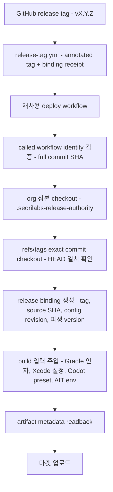

# 릴리즈 버전 authority

GitHub 릴리즈 태그 `vMAJOR.MINOR.PATCH`가 Google Play, Apple App Store, AppsInToss artifact의
**유일한 version source of truth**다. 기계 판독 정본은
[`contracts/release-version-authority.yaml`](../../contracts/release-version-authority.yaml)이고,
구현은 [`scripts/release/`](../../scripts/release/)에만 둔다. 문서와 계약이 다르면 계약이 우선한다.

## 파생 규칙

| 값 | 규칙 | `v1.2.3` |
|---|---|---|
| display / marketing version | 태그에서 `v` 제거 | `1.2.3` |
| Android `versionName` | display version | `1.2.3` |
| Android `versionCode` | `1,000,000,000 + major * 1,000,000 + minor * 1,000 + patch` | `1001002003` |
| Apple `CFBundleShortVersionString` | display version | `1.2.3` |
| Apple `CFBundleVersion` | `major * 1,000,000 + minor * 1,000 + patch` (Xcode Cloud 제외) | `1002003` |
| Play release name | display version | `1.2.3` |

Android의 `1,000,000,000`은 기존 Fleet에서 관측된 레거시 `versionCode`를 한 번에 넘기는 조직
공통 migration epoch다. 앱별 offset이나 저장소 설정이 아니므로 같은 태그는 모든 저장소에서 항상
같은 값을 만든다. `major`는 1099 이하, `minor`와 `patch`는 각각 1000 미만이어야 하며 파생
`versionCode`는 Google Play 상한 2,100,000,000을 넘지 않는다. `v0.0.0`은 Apple build number가
`0`이라 태그 생성과 배포 양쪽에서 `derived-version-code-out-of-range`로 막는다. 최소 사용 가능한
태그는 `v0.0.1`이다. 조건을 만족하지 않는 태그는 `release-tag.yml`이 생성 자체를 막고, 배포 경로도
build 전에 거부한다.

## Apple build number 예외: Xcode Cloud

계약 `schemaVersion 2`는 Apple build number의 정본을 실행 환경별로 나눈다. 기본값은 위 표의
`encoded-version`이고, **Xcode Cloud 경로만** `appleBuildNumberExceptions`로 분리한다.

| 값 | Xcode Cloud 정본 | `v0.1.9` + `CI_BUILD_NUMBER=6` |
|---|---|---|
| `CFBundleShortVersionString` | 태그에서 `v` 제거 | `0.1.9` |
| `CFBundleVersion` | Xcode Cloud가 발급한 `CI_BUILD_NUMBER` | `6` |

Xcode Cloud는 build마다 자기 카운터를 발급하고 App Store Connect는 그 번호로 build를 식별한다.
태그 파생 `encodedVersion`을 `CFBundleVersion`에 쓰면 `v0.1.9`가 `1009`, `v0.2.0`이 `2000`처럼
태그마다 값이 튀고, 같은 marketing version을 다시 올릴 때 번호가 되돌아가 업로드가 거부된다.

- `CI_BUILD_NUMBER`는 **필수**다. 값이 없거나 `0`이거나 정수가 아니면
  `xcode-cloud-build-number-invalid`로 build 전에 fail-closed한다.
- 태그 파생 `encodedVersion`은 이 경로에서 Apple build number가 아니라 런타임 최소지원버전
  비교값(`runtimeVersionCode`)으로만 남는다.
- marketing version은 여전히 태그 하나가 정본이다. 예외는 build number에만 적용된다.
- 나머지 Apple 경로(GitHub Actions `xcodebuild` archive, Godot iOS export preset)는
  `schemaVersion 1`과 같은 `encoded-version`을 그대로 쓴다.

## authority가 아닌 값

아래는 읽어서 버전을 정하지 않는다. 값이 필요하면 태그 파생값을 **주입**하고, build 후 artifact에서
다시 읽어 대조한다.

- `package.json`의 `version`
- Gradle `versionName` / `versionCode`
- Xcode `MARKETING_VERSION` / `CURRENT_PROJECT_VERSION`
- Godot `project.godot`, `export_presets.cfg`
- Granite / AppsInToss 설정
- `play-store/google-play.config.json`, `app-store/app-store.config.json`
- 저장소 로컬 `scripts/resolve-release-version.mjs`
- caller가 넘기던 `version_name`, `version_code`, `version_script` 입력
- `github.run_number` 같은 비결정 카운터 (Xcode Cloud `CI_BUILD_NUMBER`는 예외 계약이다)

## 실행 경로



1. **called workflow identity**: `job.workflow_repository`가 `seorilabs/.github`이고
   `job.workflow_ref`가 full commit SHA로 끝나야 한다. floating ref는 거부한다.
2. **org 정본 checkout**: 확인된 exact SHA로 `.seorilabs-release-authority`에 받는다. caller 저장소의
   스크립트는 버전 결정에 쓰지 않는다.
3. **exact tag commit**: `refs/tags/<tag>`로만 checkout한다. 동명 branch를 잡지 않고, checkout HEAD가
   태그 commit과 다르면 실패한다.
4. **release binding**: `tag`, `sourceSha`, `configRevision`, 파생 version을 하나의 JSON으로 고정한다.
   `authorityRevision`은 이 계약 본문의 sha256이고, `configRevision`은 여기에 called workflow
   repository/ref/SHA를 더한 값이다. 전자는 tag receipt로 대조하고 후자는 실행 provenance로 남긴다.
5. **주입**: Gradle `-PversionNameOverride`/`-PversionCodeOverride`, xcodebuild
   `MARKETING_VERSION`/`CURRENT_PROJECT_VERSION`, Godot export preset, AIT 빌드 env
   (`SEORI_RELEASE_TAG`, `SEORI_RELEASE_VERSION`, `SEORI_RELEASE_VERSION_CODE`,
   `SEORI_RELEASE_SOURCE_SHA`).
6. **readback**: build된 artifact에서 metadata를 다시 읽어 binding과 대조한다.

## artifact readback

| artifact | 도구 | 확인 값 |
|---|---|---|
| Android App Bundle | `unzip -p <aab> base/manifest/AndroidManifest.xml` → org 정본 `aapt.pb.XmlNode` parser | `android:versionName`, `android:versionCode` |
| Xcode archive | `plutil -convert json` on `<archive>/Products/Applications/<app>.app/Info.plist` | `CFBundleShortVersionString`, `CFBundleVersion` |
| `.ait` | 컨테이너 헤더(AIT v1 `appName`/`deploymentId` 또는 legacy zip) + sha256 | canonical release memo, artifact digest, 내부 version 필드 부재 |

AAB의 manifest는 protobuf(`aapt.pb.XmlNode`)이고 `aapt2 dump`는 AAB 컨테이너를 인식하지 못한다.
그래서 zip에서 직접 꺼내 org 정본 parser로 읽는다. 외부 도구 다운로드가 없다.

지원하는 `.ait` 형식(AIT v1 컨테이너, legacy zip 번들) 어느 쪽에도 내부 version 필드가 없다.
그래서 AppsInToss 배포의 태그 식별자는

```
<tag> <version> (<versionCode>) src:<source sha 12자> sha256:<artifact sha256>
```

형태의 canonical memo이며, 워크플로우는 이 memo만 배포에 사용한다. memo에 artifact digest가 들어가
있으므로 **같은 태그로 다른 파일을 올리면 대조에서 어긋난다**. 자유 형식 memo는 `memo` 입력으로
canonical memo 뒤에 덧붙고, 길이 때문에 digest가 잘릴 상황이면 자르지 않고 실패한다.
readback에서 컨테이너가 내부 version 기록을 갖고 있으면 `ait-internal-version-field-present`로
fail-closed한다. 계약을 갱신하지 않은 채 새 형식을 배포하지 않기 위해서다.

## 태그 선택과 실행 이벤트

태그 선택은 실행 이벤트에 묶인다.

| 이벤트 | `release_tag` | 선택 | source |
|---|---|---|---|
| `refs/tags/vX.Y.Z` push/dispatch | 비움 또는 같은 값 | 그 태그 | `event-tag-ref` |
| `refs/tags/vX.Y.Z` push/dispatch | 다른 태그 | **거부** | — |
| 그 밖의 ref | 명시 | 명시한 태그 | `requested-tag` |
| `workflow_dispatch` | 비움 | 최신 stable 태그 | `latest-stable-dispatch` |
| 그 밖의 ref | 비움 | **거부** | — |

저장소에 더 최신 태그가 있어도 `v1.2.0` 태그 push가 `v1.3.0`을 빌드하지 않는다. 태그 이벤트에서는
`github.sha`와 태그가 가리키는 commit이 같아야 하고, 다르면 build 전에 fail-closed한다.

## 업로드 결속

검증한 파일과 실제로 올린 파일이 다르면 안 된다. 업로드 직전에 세 가지를 강제한다.

1. artifact receipt(`seori-release-artifact: 1`)에 binding, kind, digest 출처, sha256, memo를 함께 남긴다.
2. 업로드 스텝 직전에 검증된 경로의 sha256을 다시 계산해 대조한다.
3. workspace에 업로드 후보 파일이 정확히 하나만 있는지 확인한다.

Google Play 업로드 도구에는 검증된 경로를 `--aab-path`로, AppsInToss CLI에는 검증된 absolute
경로를 `--location`으로 넘긴다. 도구가 스스로 파일을 찾지 않는다. 두 경로 모두 도구를 호출하기
직전에 digest를 다시 계산해 대조하므로, 검증과 업로드 사이에 파일이 바뀌면 걸린다. 업로드 도구는
`SEORI_EXPECTED_AAB_SHA256`과 `SEORI_EXPECTED_ANDROID_VERSION_CODE`를 필수로 요구한다.

digest 출처는 kind가 정한다. AAB와 `.ait`은 업로드 대상 파일 자체를, xcarchive는 디렉터리 번들이라
readback한 `Info.plist`를 쓴다.

트랙 승격(`promote-google-play.yml`)도 같은 authority를 쓴다. 태그에서 파생한 versionCode를
`--promote-version-code`로 넘기며, 트랙의 "최신 build"를 승격하지 않는다.

`.ait` 컨테이너는 `AITBUNDL` magic(8) + formatVersion(4) + protobuf 길이(8) + protobuf +
zip payload 길이(8) + zip payload + reserved zero trailer(8)로 framing된다. zip 길이 필드나
trailer를 건너뛰고 payload를 찾으면 payload를 열지 못한 채 "version 기록 없음"으로 통과할 수
있으므로, 전체 길이와 8-byte zero trailer를 exact로 검증한 뒤 central directory에서 entry를 읽는다.

## Godot export preset 주입

`export_presets.cfg`는 authority가 아니라 주입 대상이다. 어떤 preset을 바꿀지는 **반드시 명시**한다
(`--preset "Android"` 또는 `--preset preset.0`). 워크플로우는 주입 대상 preset과
`godot --export-release` 대상 preset에 같은 변수를 쓴다. 선택자가 없거나, 선택자가 실제 platform과
다르거나, 같은 이름 preset이 둘 이상이면 주입 전에 fail-closed한다.

## WorkflowBundle v5 정본 경로

v5 정본(`rn-build-android-cloud-v2.yml`, `godot-build-android-cloud-v2.yml`,
`ait-build-only-v1.yml`)도 같은 authority를 쓴다.

- release 실행은 `refs/tags/vX.Y.Z` push/dispatch에서만 시작한다(`binding_mode: RELEASE`).
- Backoffice resolved manifest의 `sourceRef`가 그 태그 ref와 같아야 하고, WorkflowBundle 승인
  상태가 `APPROVED`여야 한다. CANDIDATE 번들로는 마켓 artifact를 만들지 않는다.
- 세 워크플로우 모두 caller 입력을 받지 않는다. build profile, 경로, 버전은 서명된 manifest와
  태그에서만 나온다.
- build 뒤 실제 artifact(AAB 컨테이너, `.ait` 컨테이너)를 다시 읽어 태그 파생값과 대조한다.
- Cloud Build에는 `_SEORI_RELEASE_TAG`, `_SEORI_RELEASE_VERSION_NAME`,
  `_SEORI_RELEASE_VERSION_CODE`로 주입한다. 앱 build script가 이 값을 무시하면 readback에서 걸린다.

Apple archive는 Xcode Cloud가 표준 실행 환경이다. run envelope 계약은
[`contracts/xcode-cloud-run-v5.schema.json`](../../contracts/xcode-cloud-run-v5.schema.json)이며
`ci_pre_xcodebuild.sh`는 불변 중앙 commit의
`scripts/release/xcode-cloud-apply-tag-version.mjs`와 `tag-version-authority.mjs`를
각각 checksum 검증한 뒤 실행한다. 앱 저장소에 별도 version resolver를 두지 않는다.
helper의 `runtimeVersionCode`는 Android와 iOS 런타임이 공유하는 최소지원버전 비교값이며,
native `CFBundleVersion`에는 Xcode Cloud가 발급한 `CI_BUILD_NUMBER`를 그대로 쓴다.
`sourceRef`가 exact stable 태그 ref, `sourceReference.kind`가 `TAG`, `immutable`이 `true`여야 한다.
build number는 run이 시작해야 정해지므로 envelope은 기대값 대신 정본 이름만 담는다
(`release.appleBuildNumberAuthority`, `requiredReadback.buildNumberAuthority`). `requiredReadback`에는
기대 commit, reference, workflow, marketing version이 들어가고, build number는 run readback에서
양의 정수인지만 확인한다. 하나라도 어긋나면 그 archive를 마켓 경로로 넘기지 않는다. run 생성은
`capacitor-ios-xcode-cloud` profile이 승격되기 전까지 `BUILD_PROFILE_NOT_PROMOTED`로 fail-closed다.

## fail-closed 조건

`contracts/release-version-authority.yaml`의 `failClosed` 목록이 정본이다.

| 조건 | 검출 지점 |
|---|---|
| `tag-pattern-mismatch` | 태그 선택·파싱 |
| `tag-ref-mismatch` | tag receipt 대조 |
| `source-sha-mismatch` | checkout HEAD ↔ `refs/tags` commit |
| `config-revision-mismatch` | called workflow identity, authority 계약 digest |
| `artifact-provenance-mismatch` | artifact metadata readback |
| `tag-reuse-with-different-source` | annotated tag receipt의 `source-sha` |
| `tag-reuse-with-different-config` | annotated tag receipt의 `authority-revision` |
| `forbidden-authority-override` | readback이 주입값과 다른 경우 |
| `derived-version-code-out-of-range` | `v0.0.0` 등 versionCode가 1 미만인 태그 |
| `artifact-digest-mismatch` | 업로드 대상 파일 digest, memo, receipt 대조 |
| `ait-internal-version-field-present` | `.ait` 컨테이너가 내부 version 기록을 가진 경우 |
| `godot-preset-selector-required` | export preset 선택자 없이 주입을 시도한 경우 |
| `godot-preset-selector-mismatch` | 선택한 preset이 없거나 platform이 다른 경우 |
| `godot-preset-selector-ambiguous` | 같은 이름 preset이 둘 이상인 경우 |
| `xcode-cloud-build-number-invalid` | Xcode Cloud `CI_BUILD_NUMBER` 누락·`0`·비정수 |

## 태그 receipt

`release-tag.yml`은 annotated tag message에 다음 블록을 남긴다. 태그 객체는 내용 주소 기반이라
message를 바꾸면 태그 객체 자체가 달라진다.

```
Release v1.2.3 (abc1234)

seori-release-binding: 1
authority: release-version-authority-v1
authority-revision: <sha256 of contracts/release-version-authority.yaml>
tag: v1.2.3
source-sha: <40 hex>
version-name: 1.2.3
android-version-code: 1001002003
apple-build-number: 1002003
```

배포 경로는 태그가 annotated이고 이 블록이 있으면 binding과 exact match를 요구한다.
`source-sha`가 다르면 `tag-reuse-with-different-source`, `authority-revision`이 현재 실행 계약과
다르면 `tag-reuse-with-different-config`로 fail-closed한다. `authority-revision`은 계약 본문의
sha256이라 워크플로우가 달라도 같은 값이며, 계약이 바뀌면 그 태그는 새 태그로 다시 찍어야 한다.
블록이 없는 기존 태그는 태그 → commit 결속만으로 검증한다.

태그 생성은 운영자가 고른 exact source commit에만 한다. 빈 마커 커밋을 만들거나 브랜치를
push하지 않으며, 다른 commit을 가리키는 같은 이름 태그는 생성 자체가 실패한다.

## caller 이관

기계 판독 이관 계약과 인벤토리 수집기는
[caller 이관 문서](../migration/release-version-authority-callers.md)에 있다.

이 계약을 쓰는 SHA로 caller를 올릴 때 다음 입력을 **제거**해야 한다. 남아 있으면 workflow_call이
`Invalid input`으로 실패한다.

- `rn-deploy-google-play.yml`, `rn-build-android.yml`, `rn-deploy-app-store.yml`,
  `godot-deploy-app-store.yml`: `version_script`
- `godot-deploy-google-play.yml`: `version_name`, `version_code`

저장소의 `scripts/resolve-release-version.mjs`는 org 경로에서 더 이상 호출되지 않는다. 저장소 자체
용도(로컬 빌드 등)로 남길지는 각 저장소가 판단한다.

AppsInToss 배포는 이제 exact stable 태그에서만 실행된다. branch ref로 배포하던 caller는 태그를 먼저
만들어야 한다.
