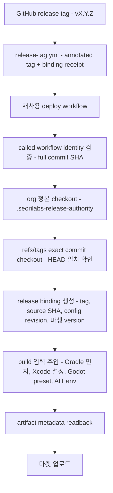

# 릴리즈 버전 authority

GitHub 릴리즈 태그 `vMAJOR.MINOR.PATCH`가 Google Play, Apple App Store, AppsInToss artifact의
**유일한 version source of truth**다. 기계 판독 정본은
[`contracts/release-version-authority.yaml`](../../contracts/release-version-authority.yaml)이고,
구현은 [`scripts/release/`](../../scripts/release/)에만 둔다. 문서와 계약이 다르면 계약이 우선한다.

## 파생 규칙

| 값 | 규칙 | `v1.2.3` |
|---|---|---|
| display / marketing version | 태그에서 `v` 제거 | `1.2.3` |
| Android `versionName` | display version | `1.2.3` |
| Android `versionCode` | `major * 1000000 + minor * 1000 + patch` | `1002003` |
| Apple `CFBundleShortVersionString` | display version | `1.2.3` |
| Apple `CFBundleVersion` | 같은 build number | `1002003` |
| Play release name | display version | `1.2.3` |

`minor`와 `patch`는 각각 1000 미만이어야 하고 파생 `versionCode`는 Google Play 상한
2,100,000,000을 넘을 수 없다. 조건을 만족하지 않는 태그는 `release-tag.yml`이 생성 자체를 막고,
배포 경로도 build 전에 거부한다.

## authority가 아닌 값

아래는 읽어서 버전을 정하지 않는다. 값이 필요하면 태그 파생값을 **주입**하고, build 후 artifact에서
다시 읽어 대조한다.

- `package.json`의 `version`
- Gradle `versionName` / `versionCode`
- Xcode `MARKETING_VERSION` / `CURRENT_PROJECT_VERSION`
- Godot `project.godot`, `export_presets.cfg`
- Granite / AppsInToss 설정
- `play-store/google-play.config.json`, `app-store/app-store.config.json`
- 저장소 로컬 `scripts/resolve-release-version.mjs`
- caller가 넘기던 `version_name`, `version_code`, `version_script` 입력
- `github.run_number` 같은 비결정 카운터

## 실행 경로



1. **called workflow identity**: `job.workflow_repository`가 `seorilabs/.github`이고
   `job.workflow_ref`가 full commit SHA로 끝나야 한다. floating ref는 거부한다.
2. **org 정본 checkout**: 확인된 exact SHA로 `.seorilabs-release-authority`에 받는다. caller 저장소의
   스크립트는 버전 결정에 쓰지 않는다.
3. **exact tag commit**: `refs/tags/<tag>`로만 checkout한다. 동명 branch를 잡지 않고, checkout HEAD가
   태그 commit과 다르면 실패한다.
4. **release binding**: `tag`, `sourceSha`, `configRevision`, 파생 version을 하나의 JSON으로 고정한다.
   `authorityRevision`은 이 계약 본문의 sha256이고, `configRevision`은 여기에 called workflow
   repository/ref/SHA를 더한 값이다. 전자는 tag receipt로 대조하고 후자는 실행 provenance로 남긴다.
5. **주입**: Gradle `-PversionNameOverride`/`-PversionCodeOverride`, xcodebuild
   `MARKETING_VERSION`/`CURRENT_PROJECT_VERSION`, Godot export preset, AIT 빌드 env
   (`SEORI_RELEASE_TAG`, `SEORI_RELEASE_VERSION`, `SEORI_RELEASE_VERSION_CODE`,
   `SEORI_RELEASE_SOURCE_SHA`).
6. **readback**: build된 artifact에서 metadata를 다시 읽어 binding과 대조한다.

## artifact readback

| artifact | 도구 | 확인 값 |
|---|---|---|
| Android App Bundle | `unzip -p <aab> base/manifest/AndroidManifest.xml` → org 정본 `aapt.pb.XmlNode` parser | `android:versionName`, `android:versionCode` |
| Xcode archive | `plutil -convert json` on `<archive>/Products/Applications/<app>.app/Info.plist` | `CFBundleShortVersionString`, `CFBundleVersion` |
| `.ait` | 컨테이너 헤더(AIT v1 `appName`/`deploymentId` 또는 legacy zip) + sha256 | canonical release memo, artifact digest |

AAB의 manifest는 protobuf(`aapt.pb.XmlNode`)이고 `aapt2 dump`는 AAB 컨테이너를 인식하지 못한다.
그래서 zip에서 직접 꺼내 org 정본 parser로 읽는다. 외부 도구 다운로드가 없다.

`.ait` 컨테이너 형식에는 버전 필드가 없다. 그래서 AppsInToss 배포의 태그 식별자는
`<tag> <version> (<versionCode>) <source sha 12자>` 형태의 canonical memo이며, 워크플로우는 이 memo만
배포에 사용한다. 자유 형식 memo는 `memo` 입력으로 canonical memo 뒤에 덧붙는다.

## fail-closed 조건

`contracts/release-version-authority.yaml`의 `failClosed` 목록이 정본이다.

| 조건 | 검출 지점 |
|---|---|
| `tag-pattern-mismatch` | 태그 선택·파싱 |
| `tag-ref-mismatch` | tag receipt 대조 |
| `source-sha-mismatch` | checkout HEAD ↔ `refs/tags` commit |
| `config-revision-mismatch` | called workflow identity, authority 계약 digest |
| `artifact-provenance-mismatch` | artifact metadata readback |
| `tag-reuse-with-different-source` | annotated tag receipt의 `source-sha` |
| `tag-reuse-with-different-config` | annotated tag receipt의 `authority-revision` |
| `forbidden-authority-override` | readback이 주입값과 다른 경우 |

## 태그 receipt

`release-tag.yml`은 annotated tag message에 다음 블록을 남긴다. 태그 객체는 내용 주소 기반이라
message를 바꾸면 태그 객체 자체가 달라진다.

```
Release v1.2.3 (abc1234)

seori-release-binding: 1
authority: release-version-authority-v1
authority-revision: <sha256 of contracts/release-version-authority.yaml>
tag: v1.2.3
source-sha: <40 hex>
version-name: 1.2.3
android-version-code: 1002003
apple-build-number: 1002003
```

배포 경로는 태그가 annotated이고 이 블록이 있으면 binding과 exact match를 요구한다.
`source-sha`가 다르면 `tag-reuse-with-different-source`, `authority-revision`이 현재 실행 계약과
다르면 `tag-reuse-with-different-config`로 fail-closed한다. `authority-revision`은 계약 본문의
sha256이라 워크플로우가 달라도 같은 값이며, 계약이 바뀌면 그 태그는 새 태그로 다시 찍어야 한다.
블록이 없는 기존 태그는 태그 → commit 결속만으로 검증한다.

태그 생성은 운영자가 고른 exact source commit에만 한다. 빈 마커 커밋을 만들거나 브랜치를
push하지 않으며, 다른 commit을 가리키는 같은 이름 태그는 생성 자체가 실패한다.

## caller 이관

이 계약을 쓰는 SHA로 caller를 올릴 때 다음 입력을 **제거**해야 한다. 남아 있으면 workflow_call이
`Invalid input`으로 실패한다.

- `rn-deploy-google-play.yml`, `rn-build-android.yml`, `rn-deploy-app-store.yml`,
  `godot-deploy-app-store.yml`: `version_script`
- `godot-deploy-google-play.yml`: `version_name`, `version_code`

저장소의 `scripts/resolve-release-version.mjs`는 org 경로에서 더 이상 호출되지 않는다. 저장소 자체
용도(로컬 빌드 등)로 남길지는 각 저장소가 판단한다.

AppsInToss 배포는 이제 exact stable 태그에서만 실행된다. branch ref로 배포하던 caller는 태그를 먼저
만들어야 한다.
