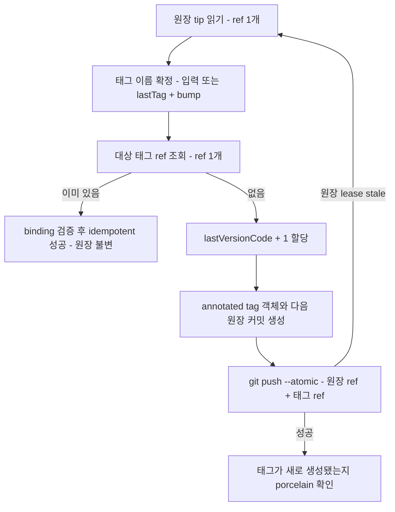

# 릴리스 번호 원장

Android `versionCode`는 태그에서 파생하지 않는다. 각 앱 저장소의 보호된 `release-version-ledger`
브랜치가 `lastVersionCode + 1`로 순차 할당한다. 기계 판독 정본은
[`contracts/release-version-ledger.yaml`](../../contracts/release-version-ledger.yaml)이고, 값의 의미는
[`contracts/release-version-authority.yaml`](../../contracts/release-version-authority.yaml)이 정한다.

두 계약을 나눈 이유는 authority 계약 본문의 sha256이 annotated tag receipt에 박히기 때문이다.
재시도 횟수 같은 운영 파라미터를 조정할 때마다 기존 receipt가 무효가 되면 안 된다. 원장 계약의
무결성은 binding `configRevision`의 `calledWorkflowSha`가 이미 덮는다.

## 원장 형식

orphan 브랜치 `release-version-ledger` 루트에 `release-version-ledger.json`과 `README.md` 두 파일만 둔다.

```json
{
  "schemaVersion": 1,
  "release": { "lastTag": "v1.0.1", "lastSourceSha": "81db938…", "marketingVersion": "1.0.1" },
  "android": { "authority": "github-ledger", "lastVersionCode": 1001000001, "legacyFallbackSealed": true },
  "ios": { "authority": "xcode-cloud", "lastObservedBuildNumber": null, "lastObservedTag": null },
  "provenance": {
    "initializedAt": "2026-09-16T03:11:00Z",
    "initializedBy": "release-version-ledger-init-v1",
    "initializedFromWorkflowSha": "<중앙 merge commit 40hex>",
    "authorityRevision": "<초기화 시점 계약 sha256>",
    "baseline": {
      "androidVersionCode": 1001000001,
      "rule": "max-of-verified-sources",
      "sources": [{ "kind": "tag-receipt", "tag": "v1.0.1", "androidVersionCode": 1001000001, "…": "…" }]
    }
  }
}
```

- **orphan인 이유**: main 이력을 물면 그 브랜치에도 `.github/workflows/*.yml`이 있어서 원장 push마다
  앱 저장소의 push 트리거 워크플로가 오발화한다. 파일 두 개짜리 orphan이면 구조적으로 불가능하고
  `git fetch --depth=1` 한 번이 전부다.
- **직렬화 고정**: 키 순서 고정 + 2-space + 끝 개행. 같은 상태가 항상 같은 blob이어야 재시도에서
  무엇이 바뀌었는지 판정할 수 있다.
- **`legacyFallbackSealed`**: 첫 원장 할당에서 `true`가 된다. 그 뒤에 GitHub UI로 찍은 receipt 없는
  태그를 구 파생식으로 배포하면 번호가 충돌하므로 `legacy-derivation-not-applicable`로 막는다.
- **`ios.lastObservedBuildNumber`의 `null`**: "모름"이 아니라 "아직 관측하지 않음"이다. 추측한 값을
  넣지 않는다.

## 할당 프로토콜

`release-tag.yml`이 유일한 할당 경로다. 배포 워크플로는 `contents: read`이고 번호를 만들지 않는다.



### atomic compare-and-swap push

```
git push --atomic --porcelain \
  --force-with-lease="refs/heads/release-version-ledger:<읽은 tip>" \
  --force-with-lease="refs/tags/<tag>:" \
  origin <원장 커밋>:refs/heads/release-version-ledger <태그 객체>:refs/tags/<tag>
```

- 원장 lease는 **실제로 읽은 tip 값**에 건다. "조상 아무거나"가 아니라 그 값을 요구하므로 경합이
  정확히 드러난다.
- 태그 lease의 빈 값은 "그 ref가 없어야 한다"는 뜻이다. 태그 이동·덮어쓰기가 push 계층에서 불가능해진다.
- `--atomic`이라 하나라도 거절되면 아무것도 반영되지 않는다.
- 커밋은 `git hash-object` + `git mktree` + `git commit-tree`로 만든다. 러너의 작업 트리는 태그 대상
  commit에 붙어 있으므로 건드리지 않는다.

**실측으로 확인한 함정**: 푸시하려는 태그 객체가 원격과 바이트 동일하면 태그 ref는 `[up to date]`
no-op이 되고 lease가 평가되지 않는다. 그 상태로 원장만 전진하면 번호가 이중 증가한다. 그래서 push가
성공해도 porcelain 출력에서 태그 ref가 `[new tag]`로 만들어졌는지 확인하고, 아니면
`ledger-atomic-push-partial`로 멈춘다.

### 재시도 경계

| 거절 사유 | 동작 |
|---|---|
| 태그 ref `stale info` (다른 실행이 먼저 만듦) | 다시 읽고 idempotency 판정으로 |
| 원장 ref `stale info` / `non-fast-forward` | 최대 5회 재시도. tip과 대상 태그 ref만 다시 읽는다 |
| 그 밖의 거절 (hook 등) | 즉시 중단. 경합으로 오인하지 않는다 |
| 부분 반영 감지 | 즉시 중단. 자동 복구하지 않는다 |

재시도 사이에 태그 이름과 target commit은 바뀌지 않는다. 바뀌는 것은 할당 번호뿐이다.

`concurrency: release-version-ledger-<repository>`는 경합 완화일 뿐이다. 수동 push나 취소된 job은
막지 못하므로 **정확성은 compare-and-swap push가 책임진다**.

## iOS 관측 기록

`CFBundleVersion`의 정본은 Xcode Cloud의 `CI_BUILD_NUMBER`다. 원장은 무엇이 관측됐는지만 남긴다.

```bash
node scripts/release/record-ios-build-observation.mjs \
  --ledger-in release-version-ledger.json \
  --ledger-out next.json \
  --readback asc-build-readback.json
```

readback 파일이 없으면 기록하지 않는다. 값을 인자로 직접 받지 않는다. `ios` 구획만 쓰므로 iOS
재빌드나 실패가 Android 번호를 소비하지 않는다. readback의 marketing version이 태그 파생값과 다르면
그 build는 다른 것이므로 `ios-observation-unverified`로 거부한다.

## 감사

전체 태그 중복·드리프트 감사는 릴리스 경로에서 실행하지 않는다.

```bash
node scripts/release/audit-release-tags.mjs ../<repo> --full-name seorilabs/<repo> --fetch
```

보고 항목: 태그별 receipt 판독, 중복 `versionCode`, 원장↔태그 드리프트, receipt 없는 태그,
등록되지 않은 계약 revision. `tag-lightweight`와 `tag-receipt-absent`는 advisory다. 조직 태그의
다수가 여기 해당하므로 blocking으로 두면 모든 앱이 영구 `NEEDS_CHANGE`가 되어 status가 신호를 잃는다.

진단은 문제를 말하고, gate는 배포를 막는다. 두 역할을 한 코드 경로에 합치면 둘 다 못 한다.

## 브랜치 보호

[릴리스 ref 보호](release-ref-protection.md)를 참조한다. 원장 브랜치에 `update` 규칙을 켜면 원장 갱신
push가 곧 ref update라 모든 릴리스가 즉시 죽는다.

## 초기화

[원장 초기화 문서](../migration/release-version-ledger-initialization.md)를 참조한다. 기준 번호를
추측하지 않는다.
