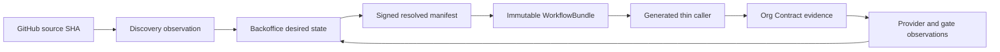

# Seorilabs Fleet Control Plane

> 상태: P0 기준선과 P1·P4·P5·P6 Backoffice 제어면 배포, P2 broker·P3 pilot·P7 cutover gate 검증 중
> 비범위: 실제 provider 계정 생성, TOTP 등록, secret 회전·폐기, 마켓 업로드, 심사 제출, 공개 배포

Fleet Control Plane은 앱 저장소마다 운영 설정과 CI를 복제하는 구조를 없애기 위한 조직
제어면이다. 새 경로의 desired state 정본은 Backoffice이며, GitHub 저장소는 source와 중앙에서
생성한 thin caller만 보유한다.



## 정본과 책임 경계

| 데이터 | 정본 | 변경 방식 |
| --- | --- | --- |
| 앱·마켓·정책 desired state | Backoffice `ConfigRevision` | UI와 AI가 같은 validator/API 사용 |
| source에서 탐지한 사실 | `DiscoveryObservation` | 고정 source SHA 기준 append-only 수집 |
| provider 실제 상태 | `ProviderObservation` | 공식 API 또는 격리 adapter readback |
| 조직 CI 계약 | 이 저장소의 `WorkflowBundle` | canary를 통과한 불변 source SHA |
| 실제 작업 | 대상 저장소 GitHub Issue | agent lease가 하나씩 claim |
| 포트폴리오 보기 | `Seorilabs Fleet` Project | Issue 상태 투영만 수행 |
| 자격증명 원본 | `~/.config/seorilabs` catalog | logical ID와 공개 identity만 제어면에 기록 |

구현, CI, artifact, upload, processing, device QA, review, approval, deployment,
public availability는 독립 gate다. 앞 gate의 성공은 뒤 gate를 증명하지 않는다.

2026-08-29 live catalog preflight는 104개 항목, 오류 0건, 경고 0건이다. 이는 catalog의
구문·참조 무결성 결과이며 provider 권한이나 실행 복제본의 존재를 뜻하지 않는다. 당시
repository·workflow 확인 범위와 남은 권한 blocker는 날짜가 고정된
[P0 기준선 스냅샷](migration/fleet-baseline-2026-08-27.md)에 보존한다.

## Provider 인증 우선순위

[`provider-auth-matrix.yaml`](../contracts/provider-auth-matrix.yaml)은 provider별 인증과
사람 gate의 중앙 정본이다. 모든 capability는 `API_WIF → BROWSER_SESSION →
BOT_PASSWORD_TOTP → HUMAN_REAUTH` 순서의 가능한 부분집합만 사용하고 마지막에는 항상 사람
재인증을 둔다. 앞 전략의 검증된 실패 없이 다음 전략으로 건너뛰지 않는다.

`ACTIVE`는 해당 logical credential의 실행 경로가 현재 사용 가능하다는 뜻이고 `PLANNED`와
`BLOCKED`는 무인 실행 권한이 아니다. 비밀번호와 TOTP는 전용 봇 계정에만 허용하며 개인 계정,
passkey, SMS, push, trusted-device, CAPTCHA, recovery, 약관·계정 승인은 항상
`HUMAN_REAUTH`다. 로그인 성공은 심사 제출, 공개 배포, role·permission·key 변경 권한을 주지
않는다. 계약은 logical ID와 공개 origin만 가지며 secret, token, cookie, TOTP seed를 수용하는
field가 없다.

## WorkflowBundle v4

[`workflow-bundle-source.yaml`](../contracts/workflow-bundle-source.yaml)은 action full SHA,
reusable workflow, runner route와 toolchain을 묶는다. 생성기는 중앙 schema·profile뿐 아니라
실제 workflow와 실행 script의 digest, 정확한 중앙 source SHA를 더해 immutable candidate를
만든다.

```bash
fleet-contract bundle \
  --source-sha 0123456789abcdef0123456789abcdef01234567 \
  --output workflow-bundle.json
fleet-contract validate-bundle --bundle workflow-bundle.json
```

candidate는 RN과 Godot canary의 고정 source SHA, run ID, artifact checksum이 모두 없으면
`APPROVED`로 승격할 수 없다. Platform release manifest가 아직 resolve되지 않은 candidate도
승인할 수 없다. 승인 snapshot은 trusted registry readback과 Ed25519 서명이 모두 검증돼야
소비할 수 있다. bundle 생성 CI는 artifact를 3일만 보관하며 release나 배포를 수행하지
않는다. 로컬 CLI에는 승인 명령이 없다.

## Zero-touch caller

GitHub App reconciler는 repository 생성·rename·archive·default push event를 받아 stack을
탐지한다. 정확히 하나의 profile이 확인되면 아래 generator 결과로 bootstrap PR을 만들고,
여러 후보면 caller를 추측하지 않고 `needs_input`을 기록한다.

webhook 검증, durable delivery, operation별 최소 권한과 운영 전 gate는
[Fleet zero-touch repository bootstrap](ci-cd/fleet-zero-touch-bootstrap.md)에 고정한다.
현재 구현은 secret-free 계획 코어이며 trusted mutation adapter를 배포한 상태가 아니다.

P3 운영 객체의 공개 정본은 `contracts/fleet-p3-runtime.yaml`과 strict schema다. 아래
renderer는 active `seorilabs-backoffice` GitHub App의 exact identity·최소 permission/event 증설,
조직 custom property·Evaluate ruleset 요청, Cloud Build keyless identity/IAM 계획, Auth Broker
기반 manifest만 출력한다. secret·승인
receipt·capability·lease token을 입력받거나 출력하지 않으며 외부 mutation도 수행하지 않는다.

```bash
node scripts/fleet/render-p3-runtime.mjs github-app
node scripts/fleet/render-p3-runtime.mjs custom-properties
node scripts/fleet/render-p3-runtime.mjs pilot-values
node scripts/fleet/render-p3-runtime.mjs ruleset
node scripts/fleet/render-p3-runtime.mjs cloud-build
node scripts/fleet/render-p3-runtime.mjs auth-broker-foundation
node scripts/fleet/render-p3-runtime.mjs auth-broker-foundation-rollback
node scripts/fleet/bootstrap-p3-github.mjs
node scripts/fleet/bootstrap-p3-gcp.mjs
node scripts/fleet/bootstrap-p3-secret-manager.mjs
```

Auth Broker foundation은 restricted namespace, API 권한이 없는 세 workload identity, exact
NetworkPolicy, cert-manager 내부 TLS와 공개 binding만 생성한다. GCP service account와 WIF가
실제 생성·readback되고 encrypted-at-rest storage 및 private GHCR pull identity가 확인되기
전에는 workload와 PVC를 만들지 않는다. 현재 적용 및 blocker 근거는
[Fleet P3 runtime 전환 기록](migration/fleet-p3-runtime-2026-08-28.md)에 고정한다.
rollback renderer는 namespace를 보존하며 foundation이 소유한 객체만 반환한다.
GitHub와 GCP bootstrap은 기본 실행이 dry-run이며 exact 공개 confirmation 없이는 mutation을
거부한다. GitHub bootstrap은 새 App을 만들지 않는다. App `4124446`, installation
`142120077`의 public identity를 먼저 읽고 기존 permission/event union을 보존한 최소 증설과
installation acceptance만 `HUMAN_REAUTH_REQUIRED` gate로 분리한다. 기존 SealedSecret의 두
encrypted field를 신규 key 생성 없이 offline 복구해 분리 logical ID로 등록하는 작업은 별도
backup/restore approval gate이며 자동 retry하지 않는다.
복구 adapter는 nonce-prefixed ciphertext와 recovery key를 process-local memory에서 직접 해제한다.
signed Security.framework native helper의 code identity와 unattended Keychain ACL이 아직 없으므로
실제 write는 `HUMAN_REAUTH_REQUIRED`로 차단한다. `security -w`, stdout, argv, environment, 평문
파일을 사용하지 않으며 helper 검증 뒤에도 App private key의 공개 SPKI fingerprint와 logical ID
상태만 반환한다. GitHub 조직 mutation은
복구 key로 만든 short-lived installation token과 exact capability adapter가 아직 검증되지 않아
ambient personal token apply를 명시적으로 차단한다.

Auth Broker의 Secret Manager 계획은 broker 전용 journal MAC/Browser Vault, password-loader
전용 fake password, TOTP signer 전용 fake seed의 네 numeric version을 서로 다른 secret-level
accessor binding으로 고정한다. 전용 bootstrap은 기본 dry-run이고 두 WIF provider와 네 resource를
모두 read-only preflight한 뒤에만 IAM을 추가한다. rollback은 IAM을 제거하지 않고 exact
Kubernetes provider만 disable한다.
네 값 생성은 raw key, base64url fake password, canonical base32 fake TOTP의 entropy만 계약에 두고,
fd3를 쓰는 native Secret Manager writer의 공개
identity·CRC32C·backup/restore가 승인되기 전에는 별도 human gate로 남긴다.

private GHCR pull은 개인 `shared/github/operator`를 canonical identity로 사용하지 않는다. 조직
전용 machine-user packages reader 또는 digest/signature가 검증된 public package 중 하나를 조직
owner가 고르고 공개 identity/package readback을 완료하기 전까지 pull Secret은 blocked다.

로컬 CLI는 caller를 생성하거나 승인하지 않는다. trusted approval key와 registry readback을
가진 GitHub App reconciler만 `loadApprovedWorkflowBundle`로 승인 binding을 만든 뒤
`generateOrgContractCaller`와 `validateOrgContractCaller`를 호출할 수 있다. 임의의 40자리
SHA나 candidate bundle은 caller 입력으로 사용할 수 없다.

caller binding은 repository numeric ID, full name, exact source SHA, discovery observation,
signed ACTIVE config revision을 함께 고정하고 5분 안에도 매 사용 시 Backoffice를 다시 읽는다.
현재 Fleet static gate branch는 `main`이므로 observation ref도 `refs/heads/main`이어야 한다.
`develop` 등 다른 default branch는 caller를 잘못 만들지 않고 `needs_input`으로 남겨 branch
이관 또는 명시적 조직 정책 변경을 요구한다.

생성 caller는 다음을 강제한다.

- 중앙 reusable workflow를 40자리 commit SHA로 참조
- caller job과 reusable workflow의 final evidence job을 결합한 실제 GitHub check 이름
  `Org Contract / Org Contract`
- `contents: read`, `packages: read` 최소 권한
- repository ID와 ref에 결합된 concurrency cancel
- `secrets: inherit`, job-local runner, step, 임의 check/install 명령 금지
- private repo는 `seorilabs-rpi-arm64`, public repo는 `ubuntu-latest`로 중앙 라우팅

GitHub은 reusable workflow check를 `<caller job> / <called job>`으로 기록한다. 실제 기존
caller run의 Jobs API readback에서도 `checks / Static checks` 형식을 확인했으므로 ruleset은
표시용 workflow 이름이 아니라 위의 물리 check 이름을 요구한다. final evidence job은
`Fleet Quality`에 `needs`로 결합되고 upstream 실패·취소 시 스스로 실패하므로 이 check 하나로
두 job을 fail-closed한다.

v4 RN과 Godot workflow는 `test:core`, `check:architecture`, `check:release`, dependency audit,
tracked source credential scan을 quality job에서 수행한다. provenance는 앱 실행면과 다른
runner job이 중앙 workflow source를 exact SHA로 다시 checkout한 뒤에만 생성한다.
Godot은 4.7.2 binary를 architecture별 공식 checksum으로 검증하고 `SCRIPT ERROR`와 `ERROR:`
로그를 실패로 처리한다.

Android build-only는 RPI5 submit/fetch와 x64 Cloud Build를 분리하고, exact source·bundle SHA,
builder digest와 AAB checksum을 provenance에 고정한다. pilot 저장소의 static 계약과 로컬
2 GiB 조건 검증은 통과했지만 조직 WIF submitter/executor binding이 승인·적용되기 전까지 실제
Cloud Build canary와 WorkflowBundle `APPROVED` 승격은 fail-closed한다. 자세한 현재 계약과
전환 조건은 [WorkflowBundle v4 shadow rollout](ci-cd/workflow-bundle-v4-shadow.md)에 고정한다.

MicroK8S 실행면은 [RPI4 capacity 정책](ci-cd/rpi4-capacity-policy.md)을 따른다. RPI4는 기존
Pod를 보존한 cordon 상태로 새 workload를 받지 않고, scheduler·ARC·Auth Broker는 exact RPI5
selector를 사용한다. 일반 ARC `1/3`, DIND `0/1`과 live Pod placement가 중앙 계약에서
벗어나면 새 Fleet 실행은 fail-closed한다.

## 기존 설정의 이관과 삭제

`.seorilabs/app.yaml`, `.seorilabs/backoffice.json`, 마켓 JSON, `market-launch-state.json`,
Platform registry JSON은 신규 정본이 아니다. 기존 consumer 때문에 현재는 legacy shadow
input으로 유지한다. 다음 조건을 모두 만족한 repository wave에서만 별도 cleanup PR로
삭제한다.

1. 같은 source SHA에서 legacy 값과 resolved manifest가 두 번 연속 일치
2. 선언한 각 market의 build-only 경로 통과
3. Backoffice 장애 중 마지막 signed ACTIVE revision으로 기존 release 재현
4. provider readback과 gate ledger 일치
5. owner와 rollback 경로 확인

Gradle, Xcode project, Godot export preset, Granite config처럼 실제 build source는 삭제 대상이
아니다. 새 변경은 Backoffice 장애 시 fail-closed하고, 이미 고정된 release candidate만 signed
snapshot으로 재현한다.

## 강제 전환 순서

1. candidate bundle과 중앙 모델을 shadow로 배포한다.
2. 공개키 ReleaseCandidate attestation과 unsigned artifact 검증을 구현한 뒤 RN
   `happy-farm`, Godot `lizard-tycoon`에서 build-only parity를 확인한다.
3. ruleset을 Evaluate로 두고 weak caller·stale SDK 탐지 오탐을 제거한다.
4. repository wave별로 bundle SHA와 Platform SDK를 갱신한다.
5. 두 번의 parity와 rollback 검증 뒤 ruleset을 Active로 바꾼다.
6. consumer가 0으로 확인된 legacy parser와 설정만 별도 PR로 제거한다.

실제 TOTP 자동화 계정 등록, GitHub App 권한 확장, WIF/IAM 생성, ruleset Active 전환,
provider write는 각각 별도 승인 및 외부 readback gate다.
