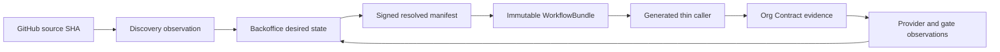

# Seorilabs Fleet Control Plane

> 상태: P0 credential 기준선 확인, repository·provider 기준선과 P1-P4 additive shadow 구현 중
> 비범위: 실제 provider 계정 생성, TOTP 등록, secret 회전·폐기, 마켓 업로드, 심사 제출, 공개 배포

Fleet Control Plane은 앱 저장소마다 운영 설정과 CI를 복제하는 구조를 없애기 위한 조직
제어면이다. 새 경로의 desired state 정본은 Backoffice이며, GitHub 저장소는 source와 중앙에서
생성한 thin caller만 보유한다.



## 정본과 책임 경계

| 데이터 | 정본 | 변경 방식 |
| --- | --- | --- |
| 앱·마켓·정책 desired state | Backoffice `ConfigRevision` | UI와 AI가 같은 validator/API 사용 |
| source에서 탐지한 사실 | `DiscoveryObservation` | 고정 source SHA 기준 append-only 수집 |
| provider 실제 상태 | `ProviderObservation` | 공식 API 또는 격리 adapter readback |
| 조직 CI 계약 | 이 저장소의 `WorkflowBundle` | canary를 통과한 불변 source SHA |
| 실제 작업 | 대상 저장소 GitHub Issue | agent lease가 하나씩 claim |
| 포트폴리오 보기 | `Seorilabs Fleet` Project | Issue 상태 투영만 수행 |
| 자격증명 원본 | `~/.config/seorilabs` catalog | logical ID와 공개 identity만 제어면에 기록 |

구현, CI, artifact, upload, processing, device QA, review, approval, deployment,
public availability는 독립 gate다. 앞 gate의 성공은 뒤 gate를 증명하지 않는다.

2026-08-27 catalog preflight는 95개 항목, 오류 0건, 경고 9건이다. 경고는 정리 완료가
아니며 credential 이동·회전·삭제의 승인 근거로 사용하지 않는다. repository와 workflow의
확인 범위 및 남은 권한 blocker는 [P0 기준선 스냅샷](migration/fleet-baseline-2026-08-27.md)에
고정했다.

## WorkflowBundle v2

[`workflow-bundle-source.yaml`](../contracts/workflow-bundle-source.yaml)은 action full SHA,
reusable workflow, runner route, toolchain, x64 Android builder digest를 묶는다. 생성기는 중앙
schema·profile의 digest와 정확한 중앙 source SHA를 더해 immutable candidate를 만든다.

```bash
fleet-contract bundle \
  --source-sha 0123456789abcdef0123456789abcdef01234567 \
  --output workflow-bundle.json
fleet-contract validate-bundle --bundle workflow-bundle.json
```

candidate는 RN과 Godot canary의 고정 source SHA, run ID, build-only artifact checksum이 모두
없으면 `APPROVED`로 승격할 수 없다. Platform release manifest가 아직 resolve되지 않은
candidate도 승인할 수 없다. bundle 생성 CI는 artifact를 3일만 보관하며 release나 배포를
수행하지 않는다. 로컬 CLI에는 승인 명령이 없으며, 승격 함수도 GitHub run·artifact를
재조회하는 trusted evidence verifier 없이는 fail-closed한다.

## Zero-touch caller

GitHub App reconciler는 repository 생성·rename·archive·default push event를 받아 stack을
탐지한다. 정확히 하나의 profile이 확인되면 아래 generator 결과로 bootstrap PR을 만들고,
여러 후보면 caller를 추측하지 않고 `needs_input`을 기록한다.

```bash
fleet-contract generate-caller \
  --profile react-native \
  --workflow-sha 0123456789abcdef0123456789abcdef01234567 \
  --working-directory . \
  --package-manager pnpm \
  --output org-contract.yml
fleet-contract validate-caller --caller org-contract.yml
```

생성 caller는 다음을 강제한다.

- 중앙 reusable workflow를 40자리 commit SHA로 참조
- required check 이름 `Org Contract`
- `contents: read`, `packages: read` 최소 권한
- repository ID와 ref에 결합된 concurrency cancel
- `secrets: inherit`, job-local runner, step, 임의 check/install 명령 금지
- private repo는 `seorilabs-rpi-arm64`, public repo는 `ubuntu-latest`로 중앙 라우팅

v2 RN과 Godot workflow는 `test:core`, `check:architecture`, `check:release`, tracked source
credential scan, source/workflow SHA provenance를 직접 실행한다. Godot은 4.7.2 binary를
architecture별 공식 checksum으로 검증하고 `SCRIPT ERROR`와 `ERROR:` 로그를 실패로 처리한다.

Android build-only workflow는 RPI에서 repository 숫자 ID로 파생한 keyless identity를 사용해
x64 Cloud Build를 submit한다. source SHA, signed config snapshot digest, release candidate ID와
builder digest가 일치해야 하며 결과는 명시적으로 unsigned artifact다. 인증 파일과 중앙
checkout은 source upload에서 강제 제외한다. Signing, Play upload, review, production 권한은
이 workflow에 없고 별도 Auth Broker capability 및 release gate가 필요하다.

## 기존 설정의 이관과 삭제

`.seorilabs/app.yaml`, `.seorilabs/backoffice.json`, 마켓 JSON, `market-launch-state.json`,
Platform registry JSON은 신규 정본이 아니다. 기존 consumer 때문에 현재는 legacy shadow
input으로 유지한다. 다음 조건을 모두 만족한 repository wave에서만 별도 cleanup PR로
삭제한다.

1. 같은 source SHA에서 legacy 값과 resolved manifest가 두 번 연속 일치
2. 선언한 각 market의 build-only 경로 통과
3. Backoffice 장애 중 마지막 signed ACTIVE revision으로 기존 release 재현
4. provider readback과 gate ledger 일치
5. owner와 rollback 경로 확인

Gradle, Xcode project, Godot export preset, Granite config처럼 실제 build source는 삭제 대상이
아니다. 새 변경은 Backoffice 장애 시 fail-closed하고, 이미 고정된 release candidate만 signed
snapshot으로 재현한다.

## 강제 전환 순서

1. candidate bundle과 중앙 모델을 shadow로 배포한다.
2. RN `happy-farm`, Godot `lizard-tycoon`에서 build-only parity를 확인한다.
3. ruleset을 Evaluate로 두고 weak caller·stale SDK 탐지 오탐을 제거한다.
4. repository wave별로 bundle SHA와 Platform SDK를 갱신한다.
5. 두 번의 parity와 rollback 검증 뒤 ruleset을 Active로 바꾼다.
6. consumer가 0으로 확인된 legacy parser와 설정만 별도 PR로 제거한다.

실제 TOTP 자동화 계정 등록, GitHub App 권한 확장, WIF/IAM 생성, ruleset Active 전환,
provider write는 각각 별도 승인 및 외부 readback gate다.
