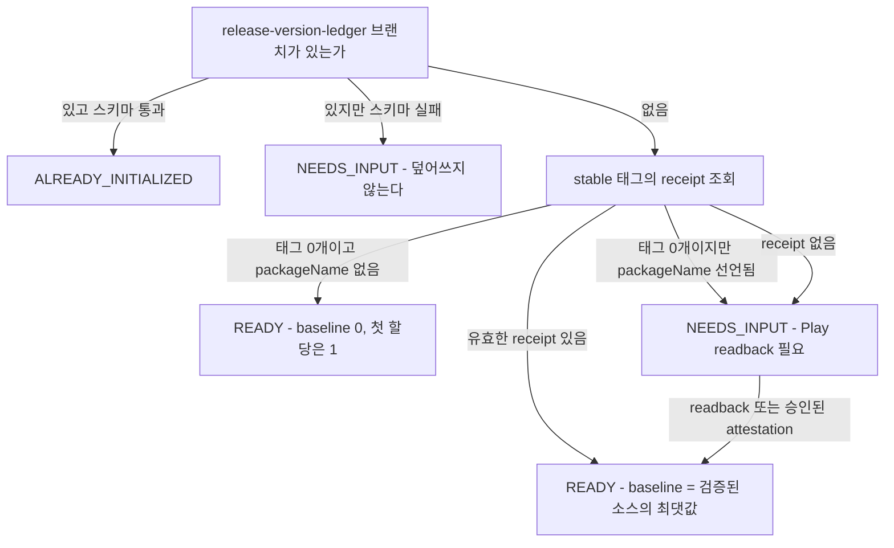

# 릴리스 번호 원장 초기화

원장은 저장소당 한 번 만든다. 잘못된 기준 번호는 그 저장소의 이후 모든 릴리스 번호를 오염시키므로,
**이 단계에서만큼은 추정을 허용하지 않는다.** 검증된 근거가 없으면 `NEEDS_INPUT`으로 멈춘다.

기계 판독 계약은 [`contracts/release-version-ledger.yaml`](../../contracts/release-version-ledger.yaml)의
`initialization` 블록이고, 판정기는 `scripts/release/init-release-version-ledger.mjs`다. 판정기는
저장소를 수정하지 않는다.

## 판정 흐름



`baseline`은 검증된 소스의 **최댓값**이다. 여러 소스가 다른 값을 내면 최댓값을 쓰되 `sources[]`에
전부 기록한다. 단조 증가를 보장하는 유일한 안전 선택이고, 소스가 하나도 없으면 최댓값이 정의되지
않으므로 자동으로 `NEEDS_INPUT`이 된다.

**"태그 0개 = Play 업로드 이력 0건"이 아니다.** `play-store/google-play.config.json`에 `packageName`이
선언돼 있으면 반드시 provider readback을 요구한다. 1부터 시작한 AAB가 기존 build와 충돌하면 업로드가
거부된다.

`authority-revision`이 현재 계약과 달라도 baseline 추출을 막지 않는다. 막으면 계약 major 직후 모든
기존 앱이 영구 `NEEDS_INPUT`이 되어 이관 자체가 불가능해진다. 대신 등록된 구 revision의 receipt는
그 계약의 공식으로 값을 재현해 확인한 뒤에만 쓴다.

**iOS는 초기화의 blocking 조건이 아니다.** `ios.lastObservedBuildNumber`의 `null`은 "아직 관측하지
않음"이라는 확정된 상태이고 Android 할당에 영향이 없다. 게이트로 만들면 Xcode Cloud를 쓰지 않는 Godot
앱이 영구 `NEEDS_INPUT`이 된다.

## 실행

```bash
# 1) 판정 (쓰기 없음). NEEDS_INPUT이면 종료 코드 1이다.
node scripts/release/init-release-version-ledger.mjs ../<repo> \
  --full-name seorilabs/<repo> --out /tmp/ledger-init.json

# 2) 실제 생성은 워크플로로 한다. 기본값은 dry_run이다.
gh workflow run init-release-version-ledger.yml --repo seorilabs/<repo> -f dry_run=true
gh workflow run init-release-version-ledger.yml --repo seorilabs/<repo> -f dry_run=false

# 3) 확인
gh api /repos/seorilabs/<repo>/contents/release-version-ledger.json?ref=release-version-ledger \
  --jq .content | base64 -d | jq '.android.lastVersionCode, .provenance.baseline'
```

초기화 push는 `--force`를 쓰지 않는다. ref가 이미 있으면 거절되는 것이 곧 idempotency 가드다.

## `NEEDS_INPUT` 해소

판정 결과의 `required[].acceptedEvidence`가 정확히 무엇을 요구하는지 담는다. 두 경로가 있다.

### provider readback (권장)

```bash
python3 scripts/release/read-google-play-version-codes.py \
  --package-name <packageName> --out play-readback.json
node scripts/release/init-release-version-ledger.mjs ../<repo> \
  --full-name seorilabs/<repo> --play-readback play-readback.json
```

Android Publisher에는 edit 없이 build를 나열하는 엔드포인트가 없어 `edits.insert`는 불가피하다.
**commit하지 않으므로 published 상태는 바뀌지 않고**, `finally`에서 항상 삭제한다. 구 APK 업로드
이력이 있는 앱은 bundle 목록만으로 최대값을 놓치므로 `apks.list`도 함께 읽는다. 출력에는 package
이름과 버전 코드, 트랙 이름만 담기고 자격증명이나 provider 오류 원문은 담기지 않는다.

조회 실패 시 stderr에 나오는 코드와 대응:

| 코드 | 뜻 | 다음 |
|---|---|---|
| `GOOGLE_PLAY_CLIENT_UNAVAILABLE` | Python 클라이언트 미설치 | 의존성 설치 후 재시도 |
| `GOOGLE_PLAY_AUTH_FAILED` | ADC 없음 | `GOOGLE_APPLICATION_CREDENTIALS` 설정 |
| `GOOGLE_PLAY_EDIT_CREATE_FAILED` | 이 앱 권한 없음 | attestation 경로로 전환 |
| `GOOGLE_PLAY_EDIT_CLEANUP_FAILED` | edit 정리 실패 | 결과를 쓰지 않는다. Play Console에서 정리 후 재시도 |

### 운영자 증명

Play Console > 릴리스 > App bundle explorer에서 최대 `versionCode`를 확인해 파일로 남긴다.

```json
{
  "kind": "human-attestation",
  "packageName": "<packageName>",
  "maxVersionCode": 0,
  "observedAt": "<ISO8601 UTC>",
  "observedBy": "<github login>",
  "evidenceUrl": "<Play Console URL>"
}
```

```bash
node scripts/release/init-release-version-ledger.mjs ../<repo> \
  --full-name seorilabs/<repo> --attestation attest.json --accept-attestation
```

`--accept-attestation`을 명시하지 않으면 attestation은 무시된다. 사람이 적은 숫자를 근거로 삼는
것은 의도적인 선택이어야 한다.

## 저장소별 현황 (2026-09-16 실측)

| 저장소 | 최신 태그 | receipt | 초기화 경로 |
|---|---|---|---|
| lord-ledger | v1.0.1 | 있음 (`android-version-code: 1001000001`) | 기존 receipt |
| lucid-chess | v3.0.9 | 있음 (구 계약 revision) | 기존 receipt (등록된 superseded revision) |
| happy-farm | v1.9.7 | 없음 (lightweight) | provider readback 필요 |
| crossword-puzzle | v1.1.9 | 없음 (lightweight, 태그 171개) | provider readback 필요 |
| lizard-tycoon | v1.4.5 | 없음 (lightweight) | provider readback 필요 |
| saju-reader | v1.0.9 | 없음 (annotated, receipt 블록 없음) | provider readback 필요 |
| jomul | v1.0.9 | 없음 (annotated, receipt 블록 없음) | 중앙 release-tag caller 부재 — 먼저 해결 |
| 태그 0개 저장소 | — | — | packageName 선언 여부로 갈린다 |

`jomul`은 `godot-deploy-google-play.yml`만 호출하고 `release-tag.yml` caller가 없다. 원장은 태그 생성
경로에서만 갱신되므로 이 상태로는 원장을 채울 수 없다. 이관 대상이 아니라 결함으로 분류하고
inventory가 `release-tag-caller-missing`으로 잡는다.
