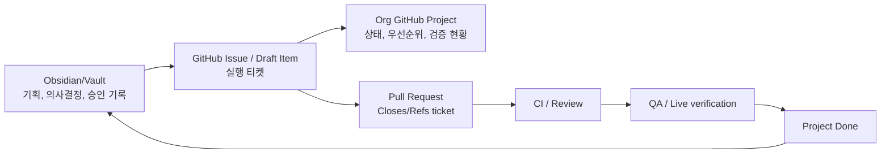

# Seorilabs GitHub Project Operations

> 현재 `Verification`과 `Release` 필드는 Org Contract v1의 독립 gate를 모두 표현하지 못하는 legacy 운영 모델이다. P4에서 `contracts/release-policy.yaml`의 gate별 evidence 필드로 이관하기 전에는 단일 필드 값을 upload·review·approval·deployment·public 완료 증거로 사용하지 않는다.

## 목적

Seorilabs Organization Project를 실행 티켓의 단일 대시보드로 사용한다. Obsidian/Vault는 기획서, 의사결정, 승인 기록의 source of truth로 유지하고, GitHub Project는 repo별 issue/PR/draft item의 실행 상태만 추적한다.

목표는 별도 종료 지점을 둔 검증 프로젝트를 만드는 것이 아니라, 실제 작업이 생길 때마다 티켓 기반 운영을 적용하고 반복적으로 개선하는 것이다.

- 장기 작업은 GitHub Issue 또는 Project item 없이 시작하지 않는다.
- PR은 반드시 실행 티켓과 연결한다.
- `Done`은 코드 작성 완료가 아니라 검증, 배포, live 확인, 문서 갱신까지 완료된 상태다.
- 기획 승인과 배포 승인은 사람이 gate로 잡고, 에이전트는 준비, 정리, 실행 보조만 맡는다.



## Project 이름

권장 이름: `Seorilabs Execution Board`

템플릿 후보 이름: `Seorilabs Execution Board Template`

GitHub 공식 문서 기준 Project template에는 views, custom fields, draft issues, associated field values, configured workflows, insights가 포함된다. 단, auto-add workflow는 template에 포함되지 않으므로 적용 repo마다 별도 설정이 필요하다.

참고:

- <https://docs.github.com/en/issues/planning-and-tracking-with-projects/learning-about-projects/best-practices-for-projects>
- <https://docs.github.com/en/issues/planning-and-tracking-with-projects/managing-your-project/managing-project-templates-in-your-organization>
- <https://docs.github.com/en/issues/planning-and-tracking-with-projects/automating-your-project/adding-items-automatically>
- <https://docs.github.com/en/issues/planning-and-tracking-with-projects/automating-your-project/using-the-api-to-manage-projects>

## 점진적 적용 repo

최근 활동과 시장/앱 유형 분산을 기준으로 먼저 적용하기 좋은 repo다. 별도 검증 목표를 두지 않고, 실제 작업이 발생하는 repo부터 Project 운영에 편입한다.

| Repo | 이유 |
| --- | --- |
| `crossword-puzzle` | AppsInToss/Web 입력/검증 이슈가 있어 QA 흐름 검증에 좋음 |
| `happy-farm` | release hygiene와 branch protection 검증 사례가 있음 |
| `lucid-chess` | Android layout, AIT ad, release runner 경계가 있어 시장별 상태 추적에 좋음 |
| `periodic-table-app` | public 앱 운영/릴리즈 준비 흐름 확인 가능 |
| `gemini-pr-bot` | 내부 운영 자동화, PR bot, CI/queue 상태 추적 검증 가능 |

## 필드 설계

상세 스키마는 [seorilabs-github-project-schema.yml](./seorilabs-github-project-schema.yml)을 기준으로 한다.

| Field | Type | 용도 |
| --- | --- | --- |
| `Status` 또는 `Stage` | Single select | 실행 단계. GitHub 기본 `Status`를 Stage 의미로 쓰는 것을 우선 검토한다. |
| `App/Repo` | Single select | 앱 또는 repo 단위 필터. 자주 다루는 repo부터 옵션에 추가하고 필요할 때 확장한다. |
| `Market` | Single select | Google Play, App Store, AppsInToss, Web, Internal 등 배포/검증 대상. |
| `Priority` | Single select | P0-P3. 이번 주 view와 triage 기준. |
| `Owner` | Single select | User, Codex, Gemini Bot 등 다음 액션 담당. |
| `Agent` | Single select | User, Codex, Claude, Gemini Bot 등 변경 주도 agent. |
| `Contribution Type` | Single select | bugfix, feature, QA, release-prep, docs, ops 등. |
| `Version Impact` | Single select | none, patch, minor, major. |
| `Intake State` | Single select | agent PR 수용 상태. |
| `Spec Version` | Text | 변경 기준이 된 spec/release 문서 버전 또는 경로. |
| `Approval` | Single select | 승인 필요 여부와 gate 종류. |
| `Target` | Date | 목표일 또는 이번 주 작업 필터 기준. |
| `Verification` | Single select | Not run, Local passed, CI passed, Live verified. |
| `Source of Truth` | Text | Obsidian/Vault 문서 경로 또는 URL. |
| `Blocked Reason` | Text | Blocked 상태의 구체 원인. |

## Stage 정의

| Stage | 이동 조건 |
| --- | --- |
| `Inbox` | 아직 문제 정의, repo, market, 승인 필요 여부가 정리되지 않은 항목 |
| `Planning` | Vault 기획/결정 문서를 작성 중이거나 승인 대기 중인 항목 |
| `Ready` | 실행 범위, acceptance criteria, 검증 방식이 명확한 항목 |
| `Development` | branch 작업 또는 구현 진행 중 |
| `Review` | PR 생성 후 리뷰/CI 대기 중 |
| `QA` | 코드 merge 전후로 수동 QA, smoke, store/console 검증 진행 중 |
| `Launch Prep` | store listing, release note, screenshot, policy, rollout 준비 중 |
| `Release` | 배포 승인 이후 실제 배포/업로드/rollout 진행 중 |
| `Done` | 검증/배포/live 확인/문서 갱신 완료 |
| `Blocked` | 외부 권한, 정책, 결제, 계정, 미정 의사결정 등으로 진행 불가 |

`Blocked`는 별도 Boolean field가 아니라 Stage로 둔다. 단일 대시보드에서 막힌 작업을 즉시 보이게 하기 위함이다.

## View 설계

| View | Layout | Filter / Group |
| --- | --- | --- |
| `전체 Board` | Board | group by `Status`/`Stage` |
| `앱별 View` | Table | group by `App/Repo` |
| `마켓별 View` | Table | group by `Market` |
| `이번 주 작업` | Table | `Target`이 7일 이내이고 `Status`/`Stage`가 `Done`이 아닌 항목 |
| `Blocked` | Table | `Status`/`Stage` = `Blocked` |
| `Launch Prep` | Board/Table | `Status`/`Stage` = `Launch Prep` |
| `Release readiness` | Table | `Status`/`Stage` in `Launch Prep`, `Release` 또는 `Approval` = `Release approval` |
| `Agent PR Intake` | Table | group by `Intake State` |

## 티켓 운영 규칙

실행 단위는 가능한 한 repo issue로 둔다. 아이디어/미분류 항목만 Project draft issue를 허용한다.

Issue 필수 항목:

- 목표와 배경
- 범위
- acceptance criteria
- 검증 계획
- 관련 Obsidian/Vault 문서
- 승인 필요 여부

문서형 템플릿은 [seorilabs-execution-ticket-template.md](./seorilabs-execution-ticket-template.md)를 사용한다. 조직 공통 issue template으로 활성화할지는 운영하면서 필요성이 확인될 때 결정한다.

PR 규칙:

- PR 제목과 description은 한글로 작성한다.
- PR description에 `Closes #123` 또는 `Refs #123`로 실행 티켓을 연결한다.
- agent PR은 [agent-contribution-contract.md](../agent-governance/agent-contribution-contract.md)를 따른다.
- 배포/릴리즈 PR은 `Approval`을 `Release approval`로 두고 사람 승인을 받은 뒤 Release stage로 이동한다.
- Copilot review는 `contracts/review-policy.yaml`에 따라 최종 HEAD에서 최초 한 번 요청한다. `unable-to-review`이거나 수용한 리뷰 수정이 새 함수·파일·분기를 만든 경우에만 한 번 더 요청한다.

## Auto-add 운영

Project template에는 auto-add workflow가 포함되지 않으므로 적용 repo별로 설정한다.

권장 필터:

```text
is:issue label:project:seorilabs-exec
```

PR도 자동 추가하려면 별도 workflow 또는 필터를 둔다.

```text
is:pr label:project:seorilabs-exec
```

GitHub 문서 기준 auto-add workflow는 repo와 필터를 지정해 새 issue/PR을 자동으로 Project에 추가한다. 기존 item은 자동으로 backfill되지 않으므로 기존 티켓은 수동 추가하거나 `gh project item-add`로 추가한다.

## 점진적 구축 순서

1. `gh auth refresh -s project`로 Project write scope를 추가한다.
2. Organization Project를 생성한다.
3. `Status`/`Stage` 옵션과 custom fields를 추가한다.
4. 위 View를 GitHub UI에서 만든다. CLI만으로 view 구성이 부족하면 브라우저 조작으로 확정한다.
5. Project README/description에 이 문서의 목적과 gate 규칙을 요약한다.
6. 실제 작업이 발생한 repo에 `project:seorilabs-exec` label을 만든다.
7. 해당 repo에 auto-add workflow를 설정한다.
8. 새 작업부터 티켓을 만들고 PR 연결, stage 이동, QA/Done 기준을 적용한다.
9. 반복적으로 걸리는 부분만 필드/뷰/템플릿에 반영한다.

## CLI 초안

현재 로컬 `gh`는 Project 기능을 지원하지만, Project 조회/생성에는 `read:project` 또는 `project` scope가 필요하다.

```bash
gh auth refresh -s project
gh project create --owner seorilabs --title "Seorilabs Execution Board" --format json
```

필드 생성 예시:

```bash
PROJECT_NUMBER="확정 필요"

gh project field-create "$PROJECT_NUMBER" \
  --owner seorilabs \
  --name "App/Repo" \
  --data-type SINGLE_SELECT \
  --single-select-options "crossword-puzzle,happy-farm,lucid-chess,periodic-table-app,gemini-pr-bot"
```

`Status`/`Stage`는 새 Project 생성 후 기본 `Status` field를 재사용할지, 별도 `Stage` field를 만들지 먼저 확인한다. 기본 workflow와 board UX를 살리려면 기본 `Status` 사용이 우선이다.

## Done 기준

작업을 `Done`으로 이동하기 전 다음을 확인한다.

- 연결 issue/PR이 존재한다.
- 필요한 리뷰와 CI가 통과했다.
- 요청된 로컬 smoke, browser/runtime 검증, store/console 확인이 끝났다.
- 배포 작업이면 release approval과 실제 배포/live 확인이 끝났다.
- Obsidian/Vault 또는 repo docs source of truth가 실제 상태와 맞다.

## 보류 사항

- Project owner/admin 권한 확인
- Project visibility와 team access 범위 결정
- `Status` 재사용 또는 `Stage` custom field 생성 결정
- auto-add workflow plan limit 확인
- 조직 공통 issue template 활성화 여부 결정
